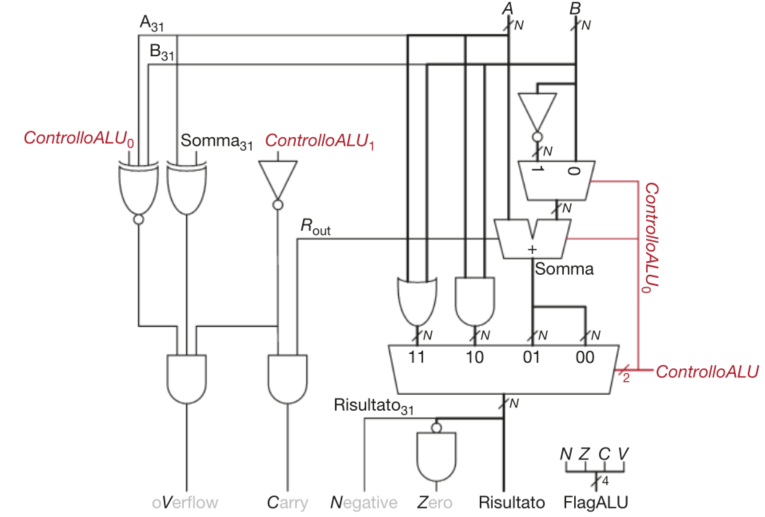
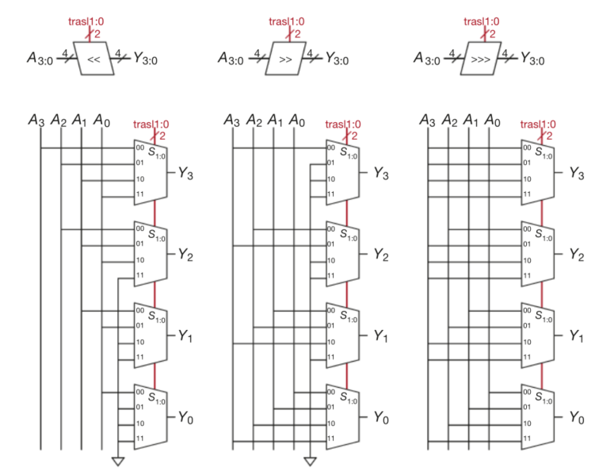
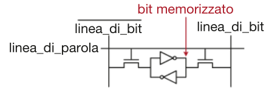

- [Blocchi costruttivi digitali](#blocchi-costruttivi-digitali)
  - [Circuiti aritmetici](#circuiti-aritmetici)
    - [Half adder](#half-adder)
    - [Full adder](#full-adder)
    - [Sommatore a propagazione di riporto a onda](#sommatore-a-propagazione-di-riporto-a-onda)
    - [Sommatore ad anticipazione di riporto](#sommatore-ad-anticipazione-di-riporto)
    - [Sommatore a prefissi](#sommatore-a-prefissi)
    - [Sottrazione](#sottrazione)
    - [Comparatore](#comparatore)
      - [Comparatore di uguaglianza](#comparatore-di-uguaglianza)
      - [Comparatore di valore](#comparatore-di-valore)
    - [ALU](#alu)
    - [Translatori e rotatori](#translatori-e-rotatori)
  - [Componenti di memoria](#componenti-di-memoria)
    - [Celle di bit](#celle-di-bit)
    - [Porte di memoria](#porte-di-memoria)
    - [Tipi di memoria](#tipi-di-memoria)
    - [DRAM](#dram)
    - [SRAM](#sram)
    - [Banchi di registri](#banchi-di-registri)
    - [ROM](#rom)

---

# Blocchi costruttivi digitali

I blocchi combinatori e sequenziali descritti di seguito sono progettati per **1 bit**. Grazie al principio di **modularità**, è possibile combinare $N$ blocchi da 1 bit per creare circuiti che operano su $N$ bit. Questo approccio consente di estendere facilmente le funzionalità senza dover riprogettare l'intero circuito.

## Circuiti aritmetici

I circuiti aritmetici sono i blocchi costruttivi centrali dei calcolatori.

### Half adder

L'half adder è un circuito che prende due bit ($A$ e $B$) in ingresso e restituisce la ($S$) ed il **riporto** o **carry** ($C$)

| $A$ | $B$ | $S$ | $C$ |
| --- | --- | --- | --- |
| 0   | 0   | 0   | 0   |
| 0   | 1   | 1   | 0   |
| 1   | 0   | 1   | 0   |
| 1   | 1   | 0   | 1   |

$$S=A\oplus B$$
$$C=A\cdot B$$


```verilog
module HA(output rip, output c, input a, input b);
    assign
        rip = a && b;

    assign
        c = a ^ b;
endmodule
```

### Full adder

Per fare un sommatore che sia modulare dobbiamo aggiungere il riporto in ingresso ($c_{in}$). Ciò si può fare usando due half-adder.

Il primo half adder prende in ingresso $A$ e $B$ restituendo $S_0$ e $C_0$.

Il secondo prende in ingresso $S_0$ $C_{in}$ restituendo $S_1$ (il risultato) e $C_1$.

Il riporto viene calcolato come:

$$C_{out}=S_0+S_1$$


```verilog
module FA(output cout, output s, input a, input b, input cin);
    wire s0, c0, c1;
    HA ha1(c0,s0,a,b);
    HA ha2(c1,s,s0,cin);
    assign
      cout = c0 || c1;
endmodule
```

Unendo $N$ full adder a 1 bit, otteniamo un sommatore completo a $N$ bit. Esistono più tipi di sommatore che possono essere realizzati unendo i full adder in modi diversi.

### Sommatore a propagazione di riporto a onda

Il metodo più semplice per costruire un **sommatore a propagazione di riporto a onda** a $N$ bit è collegare in cascata $N$ full adder completi.
In questo modo, $R_{out}$ di uno stadio costituisce $R_{in}$ per lo stadio successivo.
Il principale svantaggio legato a questo sommatore è il progressivo rallentamento all’aumentare di $N$, poiché ogni stadio deve aspettare che termini lo stadio precedente per poter iniziare.

Il ritardo di propagazione nel sommatore, $t_{propag}$, aumenta all’aumentare del numero di bit coinvolti.
$$t_{propag} = N\cdot t_{FA}$$

### Sommatore ad anticipazione di riporto

Un sommatore ad anticipazione di riporto risolve il problema della velocità dividendo il sommatore stesso in blocchi e aggiungendo un circuito per determinare velocemente il riporto di uscita da ciascun blocco appena è noto il riporto di ingresso.

La colonna i di un sommatore genera sicuramente $R_i$ se $A_i$ e $B_i$ sono entrambi uguali a 1. Si dice che la colonna $i$ **propaga** un riporto se produce un riporto di uscita ogniqualvolta ci sia un riporto di ingresso. La colonna i propaga il proprio riporto di ingresso, $R_{i−1}$, se o $A_i$ o $B_i$ sono uguali a 1.

$$R_j = A_j B_j + (A_j + B_j) R_{j-1} = G_j + P_j R_{j-1}$$

Le definizioni di **generazione** e **propagazione** si estendono ai blocchi formati da **più bit**.
$G_{i:j}$ e $P_{i:j}$ vengono definiti, rispettivamente, come segnali di generazione e di propagazione per $i$ blocchi che vanno dalla colonna $i$ alla colonna $j$.

$$R_i = G_{i:j} + P_{i:j} R_{j-1}$$

Quindi, un sommatore a $N$ bit diviso in blocchi da $k$ bit ha un ritardo pari a:

$$t_{CLA} = t_{pg} + t_{pg\_blocco} + \left(\frac{N}{k} - 1\right) t_{AND\_OR} + kt_{FA}$$

### Sommatore a prefissi

Il sommatore a prefissi estende la logica di generazione e di propagazione del sommatore ad anticipazione di riporto per eseguire l’addizione ancora più rapidamente.

In altre parole, la strategia di un sommatore a prefissi è di calcolare il più rapidamente possibile il segnale di ingresso $R_{i−1}$ per ogni colonna i per poi eseguire la somma, utilizzando l’espressione:

$$S_i = (A_i \oplus B_i) \oplus R_{i-1}$$

Dati $G_{−1} = R_{in}$ e $P_{−1} = 0$ la formula diventa:

$$S_i = (A_i \oplus B_i) \oplus G_{i-1:-1}$$

Qundi per il blocco:

$$
G_{i,j} = G_{i,k} + P_{i,k} G_{k-1,j} \\
P_{i,j} = P_{i,k} + P_{i,k} P_{k-1,j}
$$

### Sottrazione

è uguale all'addizione basta fare il complemento a 2 del secondo numero.

### Comparatore

Un comparatore determina se due numeri binari sono uguali o se uno dei due è maggiore o minore dell’altro.

#### Comparatore di uguaglianza

Ha un solo bit di uscita che indica se i numeri a N-bit passati sono uguali.


#### Comparatore di valore

Un comparatore di valore produce invece una o più uscite che indicano i valori relativi di $A$ e di $B$.

La comparazione con segno viene fatta tramite la **sottrazione**. Questo tipo di comparazione non funziona bene con l'**overflow**.

### ALU

Un’**unità logica/aritmetica (ALU, Arithmetic/Logical Unit)** unisce all’interno di una singola unità una serie di operazioni logiche e matematiche.

Una ALU tipica è in grado di eseguire le operazioni di addizione, sottrazione, AND e OR logici bit a bit. L’ALU è il cuore della maggior parte dei calcolatori.

La ALU riceve un segnale di controllo a 2 bit, chiamato **Controllo-ALU**, che specifica quale funzione debba eseguire.

Inoltre, contiene dei negatori e un multiplexer per invertire l’ingresso $B$ quando il segnale di controllo $\text{ControlloALU}_0$ è attivato.

Alcune ALU producono uscite ulteriori, chiamate **flag** (bandiere), che danno informazioni aggiuntive sul risultato dell’ALU. l’uscita FlagALU è composta dalle flag:

- $N$: il risultato dell’ALU è **negativo** ed è connessa al bit più significativo del risultato dell'ALU;
- $Z$: il risultato dell’ALU è **uguale a 0**;
- $C$: il sommatore ha generato un **carry**;
- $V$ il sommatore ha generato un **overflow**.



### Translatori e rotatori

- **Traslatore logico**: trasla un numero verso sinistra (LSL, Logical Shift Left) o verso destra (LSR, Logical Shift Right) e riempie gli spazi lasciati vuoti con 0.
- **Traslatore aritmetico**: esegue la stessa funzione di un traslatore logico, ma quando trasla un numero verso destra (ARS, Arithmetic Shift Right), riempie i bit più significativi con una copia del precedente bit più significativo (msb, most significant bit). Utile per i numeri con segno.
- **Rotatore**: trasla un numero verso sinistra (ROL, Rotate Left) o verso destra (ROR, Rotate Right) circolarmente, in modo che gli spazi lasciati vuoti vengano riempiti dai bit all’estremità opposta del numero.

Un traslatore a $N$ bit può essere costruito con un numero $N$ di multiplexer $N:1$.



## Componenti di memoria

Ci sono tre tipi di memoria principale:

- la memoria ad accesso casuale dinamica (DRAM, Dynamic Random Access Memory);
- la memoria ad accesso casuale statica (SRAM, Static Random Access Memory);
- la memoria a sola lettura (ROM, Read Only Memory).

Un componente è formato da: un numero $N$ di bit di indirizzo e un numero $M$ di bit di dato. Esso possiede $2^N$ righe e $M$ colonne.

La **lunghezza** di un componente di memoria indica il numero di **righe** che possiede, mentre la sua **larghezza** fa riferimento al numero di **colonne** e quindi alla dimensione di parola. La **dimensione totale** del componente è uguale al prodotto **lunghezza × larghezza**.

### Celle di bit

I componenti di memoria vengono realizzati come matrici di celle di bit, ognuna delle quali può contenere un bit di dato.

Quando una linea di parola è attiva, consente la lettura o la scrittura dei bit sulla riga corrispondente. Altrimenti, la cella è disconnessa.

Per leggere un bit, la linea di bit viene lasciata fluttuante ($Z$) e poi attivata la linea di parola, che imposta la linea di bit a 0 o 1 in base al valore memorizzato. Per scrivere, la linea di bit viene forzata al valore desiderato e la linea di parola viene attivata per memorizzarlo, sovrascrivendo il contenuto precedente.

### Porte di memoria

Tutte le memorie possiedono una o più porte. Ognuna di queste fornisce un accesso in lettura e/o in scrittura a un indirizzo di memoria. Le memorie **multi-porta** possono accedere a più indirizzi nello stesso momento.

### Tipi di memoria

Le memorie sono classificate in base a come immagazzinano i bit nelle celle di memoria. Si distinguono principalmente in:

- **Memorie ad accesso casuale (RAM)**: memorie **volatili** che perdono i dati quando l'alimentazione viene spenta.
- **Memorie a sola lettura (ROM)**: memorie **non volatili** che mantengono i dati anche senza alimentazione.

I due principali tipi di RAM sono la **RAM dinamica (DRAM)** e la **RAM statica (SRAM)**:

- **DRAM** immagazzina i dati come carica su un condensatore.
- **SRAM** utilizza una coppia di negatori incrociati per memorizzare i dati.

Esistono diversi tipi di **memorie ROM**, che si distinguono per il modo in cui vengono scritte e cancellate.

### DRAM

La **RAM dinamica (DRAM)** memorizza un bit tramite la presenza o assenza di carica in un condensatore. Un transistore nMOS agisce come un interruttore che collega il condensatore alla linea di bit quando la linea di parola è attiva. Se il condensatore è caricato a **VDD**, il bit memorizzato è **1**; se è scaricato a **GND**, il bit è **0**. La lettura del bit trasferisce il valore dal condensatore alla linea di bit, distruggendo il dato, che deve essere riscritto. Poiché la carica del condensatore si dissipa nel tempo, è necessario rinfrescare periodicamente la DRAM.


### SRAM

La **RAM statica (SRAM)** si chiama così perché i bit immagazzinati non necessitano di ricarica periodica. Una cella di bit della SRAM utilizza dei negatori collegati a croce per mantenere il valore del dato. Ogni cella ha due uscite, **linea_di_bit** e **linea_di_bit complementare**. Quando la linea di parola è attiva, i transistori nMOS trasferiscono i dati tra la cella e le linee di bit. A differenza della DRAM, se il valore del bit viene deteriorato dal rumore, i negatori collegati a croce ripristinano il valore corretto.



### Banchi di registri

I sistemi digitali utilizzano spesso un gruppo di registri, chiamato **banco di registri** (register file), per memorizzare variabili temporanee. Questo banco di registri è solitamente realizzato come una piccola **SRAM multi-porta**, poiché è più compatta rispetto a una matrice di flip-flop. Un banco di registri può avere più porte di lettura e scrittura, permettendo di leggere contemporaneamente da più registri e di scriverne su un altro nello stesso momento.

### ROM

La **memoria a sola lettura (ROM)** memorizza un bit attraverso la presenza o assenza di un transistor. Quando la linea di parola viene attivata, il transistor forza la linea di bit a un valore basso (0) se è presente, altrimenti la linea rimane alta (1). Essendo una memoria combinatoria, la ROM non perde il contenuto quando l'alimentazione viene interrotta. Esistono diversi tipi di ROM:

- **PROM (Programmable ROM)**: programmabile una sola volta. Utilizza fusibili che vengono bruciati per disconnettere i transistor.
- **EPROM (Erasable PROM)**: utilizza un transistor a gate sommerso. Può essere cancellata esponendo la memoria a luce UV, permettendo la rimozione degli elettroni dal gate.
- **EEPROM (Electrically Erasable PROM)**: simile all'EPROM, ma la cancellazione avviene elettricamente senza l'uso di luce UV, e consente la cancellazione di bit individuali.
- **Memorie flash**: un tipo di EEPROM, che cancella blocchi più grandi di bit anziché singoli, risultando più economica e ampiamente utilizzata per immagazzinare grandi quantità di dati in dispositivi portatili.
