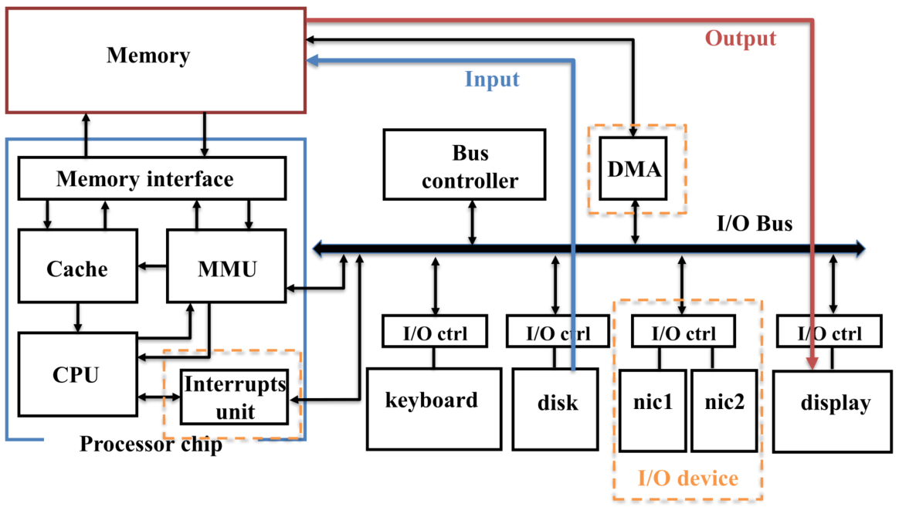
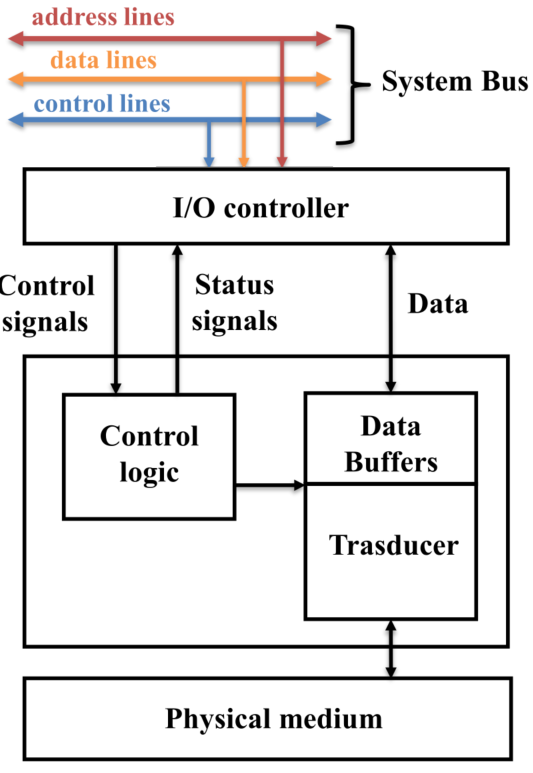
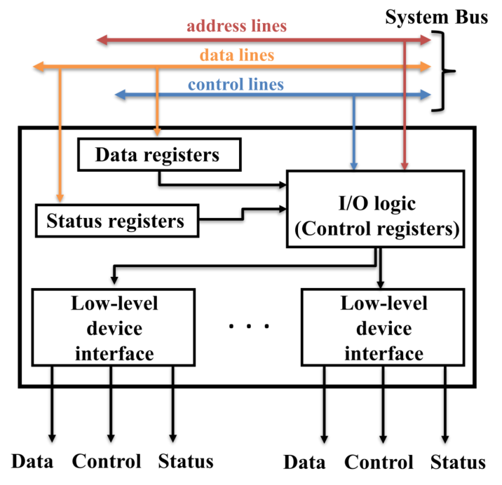
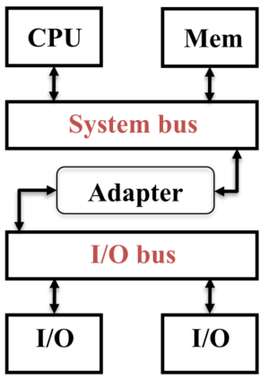
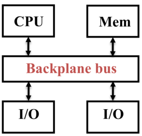

Il tempo di esecuzione è significativamente influezato dalle operazione di I/O.

# Legge di Amdahl

Essa è stata proposta nel 1967 e descrive le massime potenzialità raggiungibili da un sistema quando una sua porzione viene ottimizzata.

$$
Speedup=\frac{\text{Exec.time prima dell'ottimizzazione}}{\text{Exec.time dopo l'ottimizzazione}}
$$

Per esempio nella parallelizzazione dove $f$ è la porzione cambiata ed $1-f$ è il restante il calcolo diventa:

$$
Speedup=\frac{T(1-f)+T(f)}{T(1-f)+\frac{T(f)}{n}}=
\frac{T(1-f+f)}{T(1-f+\frac{f}{n})}=
\frac{1}{(1-f)+\frac{f}{n}}
$$

# Principi di I/O

Le performance sono molto importanti ma contano anche aspetti come:

- Affidabilità:
  - **MTTF (Mean Time To Failure)** $\rightarrow$ Tempo medio di vita di un componente;
  - **MTBF (Mean Time Between Failure)** $\rightarrow$ Tempo medio che intercorre tra i guasti non irreparabili.
  - **Fault avoidance** $\rightarrow$ Evitare i guasti per es. scegliendo componenti migliori.
  - **Fault tolerance** $\rightarrow$ tolleranza ai guasti per es. introducendo livelli di ridondanza.
- Disponibilità:
  - **MTTR (Mean Time To Repair)** $\rightarrow$ Tempo medio di riparazione.
  - $Disponibilità=\frac{MTTF}{MTTF+MTTR}$

# Porte di I/O

I dispositivi di I/O hanno due porte:

## Control

La porta di controllo è usata per mandare comandi e riportare stati di lettura.

Permette al sistema di:

- Specificare cosa dovrebbe fare il dispositivo;
- Individuare guasti e/o specifiche di dispositivo;
- Controllare lo stato delle operazioni.

## Data

La porta dei dati è utilizzata per trasferire dati da/verso i dispositivi di memoria.

# Dispositivo di I/O generico

## Controller I/O

### Componenti

Il **controller I/O** è un componente che gestisce le comunicazioni tra **CPU**, **memoria** e **periferiche**, assicurando un veloce trasferimento dei dati.

Esso agisce come intermediario tra **BUS** e **periferiche**:

- I **registri** memorizzano e gestiscono dati, comandi e informazioni di stato.
- Le interfacce a basso livello gestiscono i segnali elettrici per eseguire operazioni di I/O.

### Funzioni

- Controllo e temporizzazione

  - Gestisce il flusso di dati e segnali tra il processore, la memoria e il dispositivo di I/O.
  - Garantisce la sincronizzazione tra i componenti per evitare perdite di dati o conflitti.

- Comunicazione con il processore

  - Decodifica dei comandi (es. leggere il settore X).
  - Scambio dati: facilita il trasferimento di dati tra il processore e il dispositivo di I/O.
  - Segnalazione dello stato (es. pronto, occupato, errore).
  - Riconoscimento degli indirizzi: identifica il dispositivo o la posizione di memoria specifica.

- Comunicazione con il dispositivo

  - Scambio di comandi, informazioni di stato e dati.

- Buffering dei dati

  - Ottimizza il trasferimento dei dati e compensa le differenze di velocità.
  - Memorizza temporaneamente i dati per gestire il disallineamento di velocità tra i dispositivi e il bus di sistema.

- Rilevamento degli errori
  - Errori di trasmissione (controlli di parità).
  - Errori elettrici/meccanici.

# Comunicazioni tra CPU e device di I/O

1. La CPU interroga lo stato del dispositivo tramite il modulo I/O.
2. Il controller I/O restituisce lo stato del dispositivo.
3. Se il dispositivo è pronto, la CPU invia un comando al controller per avviare il trasferimento dati.
4. Il controller I/O recupera i dati dal dispositivo periferico.
5. Il controller I/O trasferisce i dati al processore.
6. Questi passaggi richiedono una o più operazioni di arbitraggio del bus per implementare il protocollo di comunicazione.

# BUS

- Una raccolta di linee dati trattate come un unico segnale logico.
  - Utilizzato per descrivere un insieme condiviso di linee che collegano più dispositivi (detti **taps**).

## Taps

- Dispositivi collegati a un bus condiviso, in grado di inviare o ricevere dati.
- Fattori che influenzano le prestazioni:
  - lunghezza fisica del bus;
  - numero di dispositivi collegati.

## Caratteristiche del Bus

- Il bus è un **mezzo di trasmissione condiviso**.
  - Solo un dispositivo alla volta può trasmettere con successo.
  - È necessario un **arbitraggio del bus** per gestire l'accesso quando più dispositivi vogliono trasmettere simultaneamente.

## Tipi di BUS

### Bus di sistema

Connette i principali componenti: **processore, memoria, bus di I/O**.

- **Caratteristiche:**
  - **Corto, pochi taps** $\rightarrow$ Veloce, alta larghezza di banda.
  - **Non standard** (specifico per ogni sistema).
  - Suddiviso in tre gruppi:
    - **Dati**
    - **Indirizzi**
    - **Controllo**

### Bus di I/O

Connette i dispositivi di I/O, senza collegamento diretto con il processore e la memoria.

- **Caratteristiche:**
  - **Lungo, più taps** $\rightarrow$ Più lento, bassa larghezza di banda.
  - **Standard industriale** (es. ATA, SCSI).

### Bus di backplane

Connette CPU, memoria e dispositivi di I/O.

- **Caratteristiche:**
  - **Lungo, molti taps** $\rightarrow$ Lento, larghezza di banda media/bassa.
  - Supporta dispositivi con diverse velocità di trasferimento dati.
  - **Standard industriale.**

## Progettazione del Bus

### Obiettivi

- Massime prestazioni per il **bus di sistema**.
- **I/O e backplane** mirano a standardizzazione e costi ridotti.

### Principali sfide

- **Condivisione vs separazione dei fili** $\rightarrow$ I bus più larghi offrono più banda ma sono costosi e sensibili allo skew (differenza di tempo per la propagazione di un segnale).
- **Gestione del controllo del bus** $\rightarrow$ Transazioni atomiche (semplici ma inefficienti) vs. transazioni divise (complesse ma più efficienti).
- **Sincronizzazione** $\rightarrow$ Comunicazione sincrona (clock) vs. asincrona.
- **Gestione dell'accesso** $\rightarrow$ Strategie per decidere chi usa il bus.

## Clocking del bus

### Sincrono

- Tutti i dispositivi condividono lo stesso clock, con eventi sincronizzati ai fronti di salita del segnale di clock.
- **Protocollo:**
  - Al ciclo $X$, l'unità A scrive una richiesta di lettura sul bus.
  - Al ciclo $X + \Delta$, l'unità A legge i dati, dove $\Delta$ è il tempo massimo per l'unità B per scriverli.
- **Problemi:** clock skew (differenza di tempo per la propagazione de segnale di clock).
- **Uso:** bus corti (es. bus di sistema).

### Asincrono

- Nessun clock condiviso $\rightarrow$ nessun clock skew.
- Usa protocolli di **handshaking** per la sincronizzazione.
- **Bus più lungo ma più lento**.
- **Protocollo:**
  1. UIO1 invia una richiesta di lettura/scrittura con l'indirizzo sulla linea dati.
  2. UIO2 legge l'indirizzo e invia un **ACK** (acknowledge).
  3. UIO2 scrive i dati sul bus e segnala **DataReady**.
  4. UIO1 legge i dati e invia un **ACK** a UIO2.
