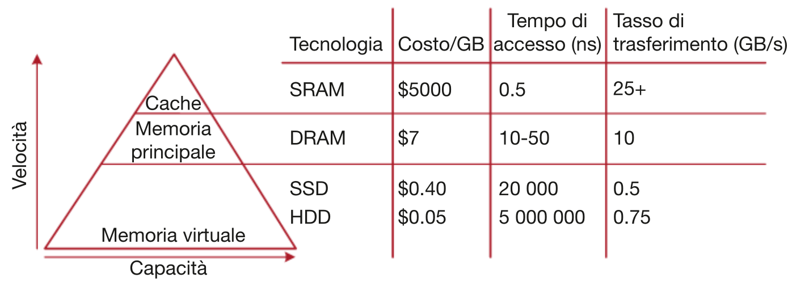
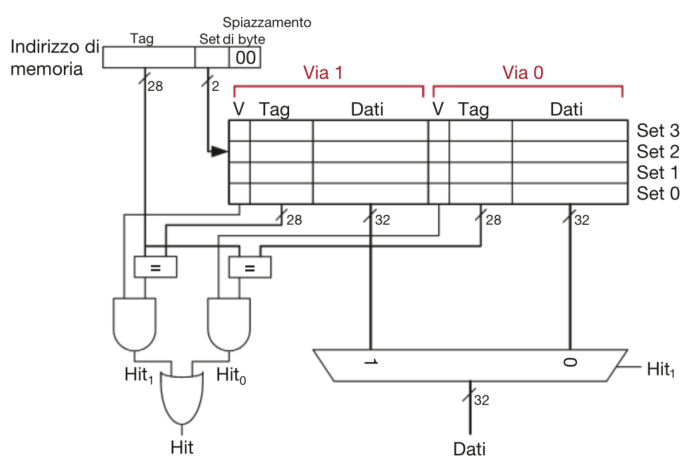
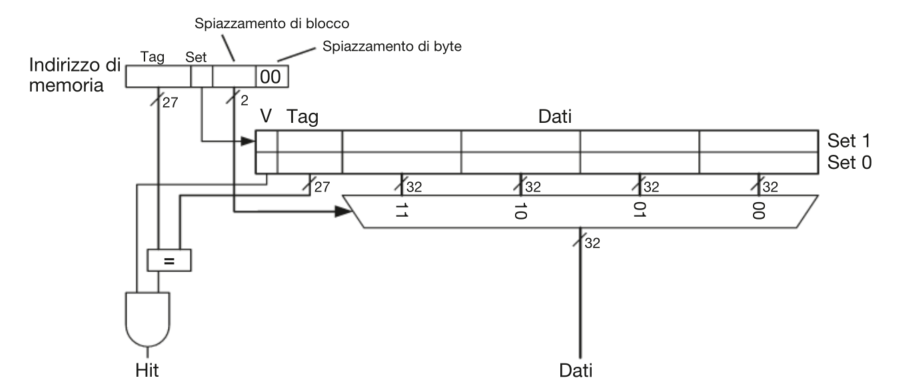

L'**architettura di von Neumann** separa CPU e memoria, che comunicano tramite in'interfaccia di memoria.

Il processore invia un indirizzo al sistema di memoria tramite il **bus indirizzi**.

In caso di lettura, il segnale **MemWrite** vale **0** e la memoria restituisce il dato sul **bus di lettura dati**.

In caso di scrittura, il segnale **MemWrite** vale **1** e il processore invia il dato alla memoria sul **bus di scrittura dati**.

Mentre un tempo, calcolo e accesso alla memoria erano bilanciati, oggi la CPU è molto più veloce della memoria, creando un divario di prestazioni significativo.

Questo effetto viene chiamato **von Neumann bottleneck**.

```mermaid
graph LR
    subgraph CPU
        CU(Control Unit)
        ALU(Arithmetic Logic Unit)
        Registers
    end

    subgraph MCPU [ ]
    CPU --> bottleneck --> Memory
    Memory --> bottleneck --> CPU
    end

    Input(Input<br>device) -->MCPU --> Output(Output<br>device)
    MCPU --> ASD(Auxiliary<br>Storage<br>device)
    ASD --> MCPU
```

# Introduzione

Il sistema di memoria ideale dovrebbe essere **veloce, grande ed economico**, ma in pratica ogni tipo di memoria soddisfa solo due di questi requisiti.

Per avvicinarsi a questo ideale, si combina:

- una memoria **veloce, piccola ed economica**
- con una memoria **lenta, grande ed economica**

La **memoria veloce** conserva i dati più usati, migliorando le prestazioni, mentre la **memoria grande** assicura un'elevata capacità complessiva.

Questo approccio è detto **gerarchia di memoria** ed è **più economico** rispetto a una memoria unica che sia contemporaneamente grande e veloce.

La **memoria** dei calcolatori è generalmente costituita da chip **DRAM** che rappresentano la memoria **grande ma lenta**.

Le **CPU** hanno al loro interno uno o più livelli di memoria **cache**, la memoria **veloce ma piccola**, che memorizza istruzioni e dati usati più di frequente.

Le **cache** sono costituite generalmente da **SRAM**, che sono intrinsecamente più veloci delle **DRAM**. Inoltre, la posizione a bordo del processore elimina i ritardi dovuti alla propagazione dei segnali elettrici tra chip diversi.

Esiste anche un livello più basso che è costituito dalla **memoria virtuale**, costituita dal **disco rigido**.

La **memoria principale**, detta anche **memoria fisica**, contiene un sottoinsieme della **memoria virtuale**.

Il processore per prima cosa cerca il dato in una memoria piccola ma veloce generalmente presente a bordo del suo stesso chip. Se non trova il dato, il processore guarda nella memoria principale. Se non lo trova neanche lì, lo preleva dalla memoria virtuale sul disco rigido, capiente ma lento.

# Terminologia e analisi delle prestazioni

## Hit e Miss

Se il processore trova il dato nel livello di memoria attuale abbiamo un **Hit**, altrimenti si dice **Miss**.

## Hit rate e Miss rate

Il tasso di hit/miss è la probabilità di ottenere un hit/miss.

$$
MR = \frac{\text{Numero Miss}}{\text{Numero totale di accessi a memoria}}=1-HR
$$

$$
HR = \frac{\text{Numero Hit}}{\text{Numero totale di accessi a memoria}}=1-MR
$$

## Miss penalty

La miss penalty è il tempo necessario per sostituire un blocco al livello n con il corrispondente blocco dal livello n-1.

## Miss time

Il Miss time è il tempo richiesto per recuperare un elemento in caso di un miss.

$$\text{miss time}=\text{miss penalty}+\text{hit time}$$

## Il tempo medio di accesso a memoria

Il tempo medio di accesso a memoria (AMAT, Average Memory Access Time) è il tempo medio di attesa da parte del processore per completare un’istruzione di lettura o scrittura in memoria.

Il processore guarda prima nella cache.

Se si verifica un miss, guarda nella memoria principale.

Se si verifica un secondo miss, il processore accede alla memoria virtuale su disco rigido.

- $t_{x}$ = tempo di accesso al livello x.
- $TM_{x}$ = Miss rate del livello x.

$$AMAT=\text{hit-time}+\text{miss-rate}*\text{miss-penalty}$$

$$AMAT=t_{1}+MR_{1}(t_{2}+MR_{2}(t_{3}+...))$$

# cache

La memoria **cache** conserva i dati usati più frequentemente. Il numero di parole che può contenere è la sua **capacità C**.

Poiché **C è molto inferiore alla memoria principale**, è necessario selezionare quali dati mantenere in cache.

Quando il processore accede a un dato:

- Se è in cache (**hit**), è **immediatamente disponibile**.
- Se non è in cache (**miss**), viene **prelevato dalla memoria principale** e **salvato in cache** per utilizzi futuri, sostituendo un dato meno recente.

Una **cache ideale** avrebbe **zero miss**, ma poiché ciò è impossibile, la cache predice i dati necessari basandosi sugli accessi passati. In particolare, sfrutta la **località spaziale** e **temporale** per ridurre i miss.

## Località spaziale

È probabile che, dopo aver letto un dato, si accederà anche ai dati vicini (es. array).

## Località temporale

Se un dato è stato utilizzato, è probabile che venga riutilizzato a breve (es. cicli).

Per sfruttare la località spaziale, la cache non preleva solo un dato alla volta, ma un **blocco di cache** contenente più parole. Il numero **b** di parole per blocco è la **dimensione del blocco**.

Una cache con capacità **C** ha quindi **B = C / b** blocchi, organizzati in **S set**.

La relazione tra un indirizzo di memoria e la sua posizione in cache è definita **mappatura** (mapping). Alcuni bit dell’indirizzo determinano in quale set si trova il dato.

Se un set contiene più blocchi, il dato può essere memorizzato in uno qualsiasi di essi. Le cache sono classificate in base al numero di blocchi per set.

## Cache a mappatura diretta

Una **cache a mappatura diretta** suddivide la memoria in blocchi di **b parole**, organizzati in **S = B set** nella cache.

- Ogni blocco di memoria è assegnato a un set specifico della cache.
- La mappatura è **circolare**: quando si superano i set disponibili, i blocchi successivi sovrascrivono i precedenti nel medesimo set.

Poiché più indirizzi possono essere mappati nello stesso set, la cache deve memorizzare l’indirizzo esatto del dato presente in ogni set.

- I **bit meno significativi** dell’indirizzo identificano il **set** in cui il dato è memorizzato.
- I **bit più significativi**, chiamati **tag**, indicano quale indirizzo specifico è effettivamente presente nel set.

### Struttura dell’Indirizzo

- **Spiazzamento**: ci sono $(log_2l)-1$ bit di spiazzamento(offset) dove $l =$ lunghezza di parola.
- **Bit di set**: i successivi $log_2S$ bit indicano il set in cui il dato è mappato.
- **Tag**: i restanti bit identificano l’indirizzo effettivo del dato nel set.

Esempio con lunghezza di parola di 8 bit e S=8

Occasionalmente, i set della cache non contengono dati, perciò la cache usa un **bit di validità** per ogni set che indica se il set contiene dati significativi.

Quando due indirizzi recenti si mappano nello stesso blocco di cache, si verifica un **conflitto**: il dato più recente sostituisce il precedente.

Nelle **cache a mappatura diretta**, ogni set contiene un solo blocco, quindi due indirizzi che si mappano nello stesso set causano sempre un conflitto.

## Cache parzialmente associativa

Una **cache parzialmente associativa a N vie** riduce i conflitti poichè ha **N blocchi per set**.

- Ogni indirizzo di memoria viene mappato in un **set specifico**, ma può essere memorizzato in **uno qualsiasi degli N blocchi** del set.
- Una **cache a mappatura diretta** è un caso particolare di cache parzialmente associativa con **N = 1**.
- **N** è chiamato **grado di associatività** della cache.

Struttura circuitale di una cache parzialmente associativa a $N = 2$ vie di capacità $C = 8$ parole.

Ogni **set** contiene **N vie** (gradi di associatività), dove:

- Ogni **via** è composta da un **blocco di dati**, un **tag** e un **bit di validità**.
- La cache legge i blocchi di tutte le vie nel set e confronta i **tag** e i **bit di validità**.
- Se si verifica un **hit**, un **multiplexer** seleziona il dato dalla via corrispondente.

### Vantaggi e Svantaggi

:white_check_mark: **Meno conflitti** e **tassi di miss inferiori** rispetto alla mappatura diretta.

:x: **Più lenta e costosa** a causa del multiplexer di uscita e dei comparatori aggiuntivi.

## Cache completamente associativa

Una **cache completamente associativa** ha un **unico set** con **B vie**, dove **B è il numero totale di blocchi**.

- Un indirizzo di memoria può essere memorizzato in **qualsiasi blocco** della cache.
- È un caso particolare di **cache parzialmente associativa** con **grado di associatività B**.

- Ogni **set** contiene **un solo blocco**.
- Con **2 set**, sono necessari **log₂2 = 1 bit** per selezionare il set.
- Un **multiplexer** sceglie la parola all’interno del blocco.
- Serve **un solo tag** per l’intero blocco, poiché le parole hanno **indirizzi consecutivi**.

### Vantaggi e Svantaggi

:white_check_mark: **Meno conflitti** rispetto ad altre configurazioni.

:x: **Richiede più hardware** per il confronto dei tag.

:x: **Adatta solo per cache piccole** a causa dell’elevato numero di comparatori.

## Tabella riassuntiva

| Organizzazione            | Numero di vie (M) | Numero di set in cache (S) |
| ------------------------- | ----------------- | -------------------------- |
| A mappatura diretta       | 1                 | B                          |
| Parzialmente associativa  | 1 < N < B         | B/N                        |
| Completamente associativa | B                 | 1                          |

## Politiche di Sostituzione: LRU e Pseudo-LRU

Il **principio di località temporale** suggerisce di **sostituire il blocco meno utilizzato di recente** (Least Recently Used, **LRU**) poiché ha **minor probabilità di essere riutilizzato a breve**.

### LRU nelle Cache Parzialmente Associative

- **Cache a 2 vie**: un **bit di utilizzo (U)** indica quale via è stata usata meno di recente.
  - Ogni accesso aggiorna **U** per indicare l’altra via.
- **Cache con più di 2 vie**: gestire LRU diventa complesso.

### Pseudo-LRU

- Le vie vengono divise in **due gruppi**.
- **U indica il gruppo meno utilizzato** di recente.
- Alla sostituzione, si rimpiazza **un blocco a caso** all’interno del gruppo.
- È una **soluzione semplificata** ma efficace in pratica.

## Cache multi-livello

I moderni calcolatori adottano spesso almeno due livelli di cache per cercare di ridurre i tempi dell'[AMAT](#il-tempo-medio-di-accesso-a-memoria)

## Classificazione dei Miss nella Cache

I miss nella cache si possono classificare in tre categorie:

1. **Miss inevitabili**: Si verificano alla prima richiesta di un blocco di cache, poiché il dato deve essere letto dalla memoria principale.
2. **Miss di capacità**: Avvengono quando la cache è troppo piccola per contenere tutti i dati utilizzati contemporaneamente.
3. **Miss di conflitto**: Si manifestano quando più indirizzi vengono mappati nello stesso set, causando l'espulsione di blocchi ancora necessari.

## Ottimizzazione delle Prestazioni della Cache

Le prestazioni della cache possono essere valutate eseguendo benchmark e variando i suoi parametri.

### Impatto della Dimensione della Cache e dell'Associatività

- **Benchmark SPEC2000** mostra che:
  - I miss inevitabili sono pochi e concentrati vicino all'asse x del grafico.
  - **Aumentare la capacità della cache** riduce i miss di capacità.
  - **Aumentare il grado di associatività**, specialmente per cache piccole, riduce i miss di conflitto.
  - Associatività superiori a 4-8 vie danno solo minime riduzioni del tasso di miss.

### Impatto della Dimensione del Blocco

- **Aumentare la dimensione del blocco** sfrutta la località spaziale.
- Per cache **piccole (es. 4 KB)**, blocchi superiori a 64 byte aumentano i miss per conflitti.
- Per cache **grandi**, blocchi oltre 64 byte non modificano il tasso di miss.
- Blocchi più grandi possono **aumentare il tempo di esecuzione** a causa di una maggiore penalizzazione di miss.

## Politiche di Scrittura nella Cache

Le operazioni di scrittura in memoria seguono un processo simile a quelle di lettura:

- **Hit**: Il dato viene scritto direttamente nella cache.
- **Miss**: Il blocco mancante viene prelevato dalla memoria principale, copiato nella cache e poi scritto.

### Tipologie di Cache per la Scrittura

Le cache si classificano in due categorie principali:

#### Cache Write-Through

- Il dato viene scritto **simultaneamente** sia nella cache che nella memoria principale.
- **Non necessita di un bit di modifica (dirty bit).**
- Richiede **più accessi** alla memoria principale, aumentando la latenza.

#### Cache Write-Back

- Utilizza un **bit di modifica (dirty bit) M** per ogni blocco:
  - **M = 1** $\rightarrow$ Il blocco è stato modificato almeno una volta.
  - **M = 0** $\rightarrow$ Il blocco non è stato modificato.
- Il dato viene scritto nella memoria principale **solo quando il blocco viene espulso** dalla cache.
- **Riduce il numero di accessi alla memoria principale**, migliorando le prestazioni.

Le cache moderne sono prevalentemente **write-back**, poiché la memoria principale è troppo lenta per gestire continui accessi.

## Evoluzione delle Cache: Cause e Tendenze

Le tendenze nello sviluppo delle cache sono influenzate da due fattori principali:

1. **Disparità crescente tra la frequenza della CPU e la velocità della memoria principale**

   - È necessario ridurre il tasso di miss per evitare colli di bottiglia nella memoria principale.

2. **Diminuzione del costo dei transistor**
   - Permette la realizzazione di cache sempre più grandi, migliorando le prestazioni complessive del sistema.

# Memoria virtuale

## Disco Rigido nella Gerarchia di Memoria

- I moderni calcolatori utilizzano dischi rigidi **magnetici** o **a stato solido** come livello più basso della gerarchia di memoria.
- I dischi rigidi sono **grandi ed economici**, ma **molto lenti** rispetto alla memoria RAM.

## Indirizzi Virtuali e Page Fault

- I programmi utilizzano **indirizzi virtuali** per accedere ai dati nella memoria virtuale.
- La memoria fisica contiene solo un sottoinsieme della memoria virtuale più recente.
- Se un indirizzo virtuale non è presente in memoria fisica, si verifica un **page fault**, e il sistema operativo carica la pagina mancante dal disco.

## Tabella delle Pagine e Traduzione degli Indirizzi

- Una **tabella delle pagine** viene utilizzata per tradurre gli indirizzi virtuali in indirizzi fisici.
- Ogni voce della tabella indica se la pagina è in memoria fisica o solo su disco.
- Ogni accesso alla memoria richiede:
  1. Un accesso alla tabella delle pagine.
  2. Un accesso alla memoria fisica.

## Translation Lookaside Buffer (TLB)

- La tabella delle pagine è generalmente **troppo grande** per essere letta rapidamente.
- Il **TLB** è una cache che memorizza le traduzioni più frequenti per velocizzare l’accesso alla memoria.

## Traduzione degli Indirizzi Virtuali in Indirizzi Fisici

### Struttura degli Indirizzi

- Sia la **memoria virtuale** che la **memoria fisica** sono divise in **pagine**.
- Un indirizzo è composto da:
  - **Bit meno significativi** $\rightarrow$ Indicano lo **spiazzamento di pagina** (offset) e non richiedono traduzione.
  - **Bit più significativi** $\rightarrow$ Specificano il **numero di pagina** e devono essere tradotti.

### Processo di Traduzione

- Solo il **numero di pagina virtuale (NPV)** deve essere tradotto per ottenere l'**indirizzo fisico**.
- Esempio di suddivisione dell'indirizzo:
  - **12 bit meno significativi** $\rightarrow$ Spiazzamento di pagina.
  - **19 bit successivi** $\rightarrow$ Numero di **pagina virtuale (NPV)**.
  - **15 bit risultanti** $\rightarrow$ Numero di **pagina fisica (NPF)** dopo la traduzione.

## Uso della Tabella delle Pagine

### Struttura e Funzionamento

- Il processore utilizza la **tabella delle pagine** per tradurre gli indirizzi virtuali in indirizzi fisici.
- Ogni elemento della tabella contiene:
  - **Numero di pagina fisica (NPF)** corrispondente.
  - **Bit di validità (V)**:
    - **V = 1** $\rightarrow$ La pagina è in memoria fisica.
    - **V = 0** $\rightarrow$ La pagina deve essere caricata da disco.

### Memorizzazione e Accesso

- La tabella delle pagine è **molto grande**, quindi è **memorizzata in memoria fisica**.
- Il processore utilizza un **registro di tabella delle pagine** per memorizzare l’indirizzo base della tabella in memoria fisica.

### Processo di Traduzione

1. Il processore estrae il **numero di pagina virtuale (NPV)** dall’indirizzo virtuale.
2. Usa il **registro di tabella delle pagine** per trovare l’elemento corrispondente.
3. Se la pagina è valida, combina il **numero di pagina fisica (NPF)** con lo **spiazzamento di pagina** per ottenere l’indirizzo fisico.
4. Effettua la **lettura o scrittura** sulla memoria fisica.

### Impatto sulle Prestazioni

- Poiché la tabella delle pagine è in **memoria fisica**, ogni accesso alla memoria richiede **due accessi**:
  1. Uno per la tabella delle pagine.
  2. Uno per il dato richiesto.

## Il Translation Lookaside Buffer (TLB)

### Località e Efficienza

- Gli accessi alla **tabella delle pagine** presentano un’**elevata località temporale e spaziale**.
- Poiché molte operazioni fanno riferimento alla stessa pagina, il processore può **riutilizzare** l’ultima traduzione senza doverla rileggere.
- Per migliorare l’efficienza, il processore utilizza il **Translation Lookaside Buffer (TLB)**, che memorizza un insieme di traduzioni recenti.

### Funzionamento del TLB

- Il TLB è una **cache completamente associativa** che memorizza tipicamente **da 16 a 512 elementi**.
- Ogni elemento contiene:
  - **Numero di pagina virtuale (NPV)**.
  - **Numero di pagina fisica (NPF)** corrispondente.
- Quando il processore accede a un indirizzo virtuale:
  1. **Cerca nel TLB** il numero di pagina virtuale.
  2. Se trova un **hit**, restituisce il numero di pagina fisica direttamente.
  3. Se si verifica un **miss**, deve accedere alla **tabella delle pagine in memoria fisica**.

### Benefici del TLB

- Il TLB è **molto veloce**, con tempi di accesso inferiori a **un ciclo di clock**.
- Ha un **tasso di hit superiore al 99%**, riducendo il numero di accessi alla memoria da **due a uno** per ogni operazione di lettura o scrittura.

## Protezione della Memoria e Memoria Virtuale

### Necessità della Protezione

- I moderni calcolatori eseguono **più programmi contemporaneamente**.
- È essenziale garantire che **un programma non possa interferire con un altro**, evitando accessi non autorizzati alla memoria.
- Questa garanzia si chiama **protezione della memoria**.

### Ruolo della Memoria Virtuale

- Ogni programma ha il proprio **spazio di indirizzamento virtuale**.
- Un programma può utilizzare la sua memoria virtuale senza preoccuparsi della posizione fisica degli altri programmi.
- Un programma può accedere **solo alle pagine fisiche mappate nella propria tabella delle pagine**, impedendo l’accesso a quelle di altri programmi.

### Condivisione Controllata

- Se più programmi devono accedere a dati comuni, il **sistema operativo** può gestire l’accesso con **bit di controllo** nelle tabelle delle pagine.
- Questi bit determinano **quali programmi** hanno il diritto di leggere o scrivere in pagine condivise.

## Politiche di Scrittura e Sostituzione nella Memoria Virtuale

### Politica di Scrittura: Write-Back

- La memoria virtuale utilizza una **politica di scrittura write-back**.
- Una pagina viene scritta su disco **solo quando deve essere espulsa** dalla memoria fisica.
- La politica **write-through** sarebbe troppo lenta, poiché ogni scrittura implicherebbe un accesso al disco.

### Paging e Swap Area

- Quando si verifica una **mancanza di pagina (page fault)**, il sistema rimuove una pagina fisica **poco utilizzata** e la sostituisce con quella mancante.
- Il disco rigido utilizzato per la memoria virtuale è chiamato **swap area**.

### Politica di Sostituzione: LRU Approssimata

- Il sistema operativo adotta una politica **approssimativa di tipo LRU (Least Recently Used)**.
- Per supportare questa politica, ogni elemento della **tabella delle pagine** ha due bit di stato:
  - **Bit di Modifica (M)**: indica se la pagina è stata modificata dopo il caricamento. Se vale **1**, la pagina deve essere riscritta su disco prima della rimozione.
  - **Bit di Utilizzo (U)**: indica se la pagina è stata usata di recente.

### Gestione della Sostituzione

- Il sistema operativo **resetta periodicamente** tutti i bit di Utilizzo.
- Quando una pagina viene acceduta, il suo bit **U viene impostato a 1**.
- In caso di **mancanza di pagina**, il sistema cerca una pagina con **U = 0** da sostituire.
- Questa tecnica **non garantisce una LRU perfetta**, ma è un’**approssimazione efficiente**.

## Tabelle delle Pagine a Più Livelli

### Struttura a Due Livelli

- Per **risparmiare memoria**, le tabelle delle pagine possono essere suddivise in **due livelli**.
- La **tabella di primo livello** è sempre in memoria fisica e contiene riferimenti alle **tabelle di secondo livello**.
- Le **tabelle di secondo livello** contengono la traduzione degli indirizzi virtuali e possono essere **mantenute su disco** se non utilizzate.

### Suddivisione degli Indirizzi

- Il **numero di pagina virtuale** è diviso in:
  - **Numero di tabella delle pagine** $\rightarrow$ Indice nella tabella di primo livello.
  - **Spiazzamento di tabella delle pagine** $\rightarrow$ Indice nella tabella di secondo livello.

### Vantaggi e Svantaggi

:white_check_mark: **Vantaggio**: Riduce il consumo di memoria, evitando di mantenere in RAM tabelle non necessarie.

:x: **Svantaggio**: Se il TLB non ha la traduzione memorizzata, è necessario **un accesso in più alla memoria**, rallentando il processo.
