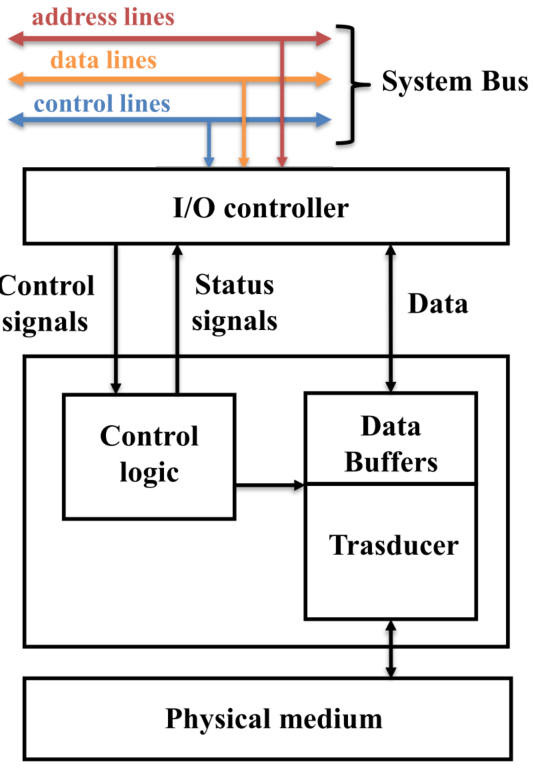

Oltre al processore e alla memoria, un sistema di computer ha il bisogno di interfacciarsi con l'ambiente esterno, questo viene fatto attraverso le operazioni di **I/O**, che passano per dei **moduli di I/O** arrivando ai dispositivi esterni detti **periferiche**.

I **moduli di I/O** non sono semplici connettori, ma contengono logica per trasferire dati tra il bus di sistema e i dispositivi esterni, poichè questi ultimi hanno velocità, formati e funzionamenti incompatibili con il **bus di sistema**.

Per risolvere questi problemi, i **moduli di I/O** svolgono due funzioni principali:

1. **Interfacciarsi con il processore e la memoria** tramite il bus di sistema.
2. **Gestire la comunicazione con le periferiche** tramite collegamenti dati dedicati.

# Dispositivi di I/O

Ogni dispositivo esterno si collega al computer tramite un **modulo di I/O**, questi dispositivi sono noti come **periferiche** e si dividono in:

1. **Human-readable** $\rightarrow$ Per l'interazione con l’utente (es. monitor, tastiere, stampanti).
2. **Machine-readable** $\rightarrow$ Per la comunicazione con altri dispositivi (es. dischi magnetici, nastri, sensori, attuatori).
3. **Comunicazione** $\rightarrow$ Per lo scambio di dati con dispositivi remoti, come terminali o altri computer.

Essi si interfacciano con il modulo di I/O tamite tre tipi di segnali:

- **Controllo** $\rightarrow$ Definiscono le operazioni del dispositivo (es. lettura, scrittura, segnalazione dello stato).
- **Dati** $\rightarrow$ Insieme di bit trasferiti tra il dispositivo e il modulo di I/O.
- **Stato** $\rightarrow$ Indicano se il dispositivo è pronto per il trasferimento dati (es. READY/NOT-READY).

Un **buffer** è spesso presente per memorizzare temporaneamente i dati trasferiti. Nei dispositivi seriali è solitamente di 8-16 bit, mentre nei dispositivi a blocchi (es. dischi) può essere molto più grande.

# Modulo I/O

## Funzioni del modulo

Le principali funzioni o requisiti di un modulo I/O rientrano nelle seguenti categorie:

- Controllo e temporizzazione
- Comunicazione con il processore
- Comunicazione con il dispositivo
- Bufferizzazione dei dati
- Rilevamento degli errori

Visto che le risorse interne, come la memoria principale e il bus di sistema, devono essere condivise tra diverse attività, incluso l'I/O dei dati, la funzione di I/O include un requisito di controllo e temporizzazione per coordinare il flusso del traffico tra risorse interne e dispositivi esterni.

Se il sistema utilizza un bus, ciascuna delle interazioni tra il processore e il modulo I/O implica una o più arbitrati del bus.

Il modulo I/O deve comunicare sia con il processore che con il dispositivo esterno. La comunicazione con il processore coinvolge:

- **Decodifica dei comandi** $\rightarrow$ Il modulo I/O accetta comandi dal processore, solitamente inviati come segnali sul bus di controllo.
- **Dati** $\rightarrow$ I dati vengono scambiati tra il processore e il modulo I/O attraverso il bus dati.
- **Segnalazione di stato** $\rightarrow$ Poiché le periferiche sono molto lente rispetto al processore, è importante conoscere lo stato del modulo I/O.
- **Riconoscimento dell'indirizzo** $\rightarrow$ Il modulo I/O deve riconoscere un indirizzo di memoria univoco per ogni periferica che controlla.

Mentre la comunicazione con il dispositivo coinvolge:

- comandi;
- informazioni di stato;
- dati.

Una funzione essenziale di un modulo I/O è la **bufferizzazione dei dati**. La necessità di questa funzione è evidente dalle differenze di velocità tra i dispositivi.

- I dati provenienti dalla memoria principale vengono inviati rapidamente al modulo I/O, che li memorizza temporaneamente per poi inviarli al dispositivo alla velocità appropriata.
- Viceversa, i dati in ingresso vengono bufferizzati per evitare di impegnare la memoria con trasferimenti lenti.

Se il dispositivo opera a una velocità superiore a quella di accesso alla memoria, il modulo I/O deve comunque gestire la bufferizzazione per sincronizzare i tassi di trasferimento.

Infine, un modulo I/O è spesso responsabile del **rilevamento degli errori** e della successiva segnalazione al processore.

Esistono due principali classi di errori:

1. **Errori meccanici ed elettrici** $\rightarrow$ Malfunzionamenti segnalati dal dispositivo.
2. **Errori di trasmissione** $\rightarrow$ Modifiche non intenzionali ai dati trasmessi tra il dispositivo e il modulo I/O.

Spesso vengono usati codici di rilevamento degli errori per identificare gli errori di trasmissione.

## Struttura del modulo I/O

I moduli di I/O variano notevolmente in complessità e nel numero di dispositivi esterni che controllano. Qui forniremo solo una descrizione generale.

Ecco un diagramma a blocchi di un generale modulo di I/O:

Il modulo si collega al resto del computer attraverso un insieme di linee di segnale.

Poi ci sono vari registri:

- **registri dati** in cui si memorizzano temporaneamente i dati da e verso il modulo.
- **Registri di stato** che forniscono informazioni sullo stato attuale.
- **Registro di controllo**, accetta informazioni di controllo dettagliate dal processore, può coincidere con il **registro di stato**.

La logica interna del modulo interagisce con il processore tramite un insieme di linee di controllo.

Il processore utilizza queste linee per inviare comandi al modulo di I/O. Alcune di queste linee possono essere usate dal modulo di I/O per funzioni come l'arbitraggio e i segnali di stato. Il modulo deve anche essere in grado di riconoscere e generare indirizzi associati ai dispositivi che controlla.

Ogni modulo di I/O ha un indirizzo univoco o, se controlla più dispositivi esterni, un insieme di indirizzi univoci. Infine, il modulo di I/O contiene una logica specifica per l'interfaccia con ciascun dispositivo che controlla.

Un modulo di I/O permette al processore di interagire con un'ampia gamma di dispositivi in modo semplificato nascondendo i dettagli relativi ai tempi, ai formati e agli aspetti elettromeccanici di un dispositivo esterno, in modo che il processore possa operare con semplici comandi di lettura e scrittura, e possibilmente con comandi di apertura e chiusura file.

Nella sua forma più semplice, il modulo di I/O può comunque lasciare visibili al processore molte delle operazioni di controllo di un dispositivo.

Un modulo di I/O che si occupa della maggior parte del carico di elaborazione dettagliato, presentando un'interfaccia ad alto livello al processore, è solitamente chiamato **canale di I/O** o **processore di I/O**.

Un modulo di I/O più primitivo, che richiede un controllo dettagliato, è generalmente chiamato **controller di I/O** o **controller di dispositivo**.

I controller di I/O sono comunemente utilizzati nei microcomputer, mentre i canali di I/O sono impiegati nei mainframe.

# Tecniche di Operazioni di I/O

Tre tecniche sono possibili per le operazioni di I/O:

Con il **Programmed I/O**, il processore deve attendere fino al completamento dell'operazione di I/O.

Con l'**Interrupt-driven I/O**, il processore continua a eseguire altre istruzioni e viene interrotto dal modulo di I/O quando quest'ultimo ha completato il suo lavoro.

Con entrambi gli approcci il processore è responsabile dell'estrazione e della meorizzazione dei dati.

L'alternativa è nota come **accesso diretto alla memoria (DMA)**. In questa modalità, il modulo di I/O e la memoria principale scambiano dati direttamente, senza il coinvolgimento del processore.

La seguente tabella indica la relazione tra queste tre tecniche.

|                                 | Nessuna interruzione | Interruzioni               |
| ------------------------------- | -------------------- | -------------------------- |
| Tasferimento tramite processore | Programmed I/O       | Interrupt-driven I/O       |
| Trasferimento diretto           |                      | Direct memory access (DMA) |

## Programmed I/O

Quando il processore esegue un programma e incontra un'istruzione relativa all'I/O, esegue quell'istruzione inviando un comando al modulo di I/O appropriato.

Con l'I/O programmato, il modulo di I/O eseguirà l'azione richiesta e poi imposterà i bit appropriati nel registro di stato dell'I/O. Il modulo di I/O non intraprende ulteriori azioni per avvisare il processore. In particolare, non interrompe il processore.

Pertanto, è responsabilità del processore controllare periodicamente lo stato del modulo di I/O fino a quando non verifica che l'operazione sia completata.

### Comandi I/O

Per eseguire un'istruzione relativa all'I/O, il processore emette un indirizzo, specificando il modulo di I/O, il dispositivo esterno, e un comando di I/O.

Esistono quattro tipi di comandi di I/O che un modulo di I/O può ricevere quando viene indirizzato da un processore:

- **Control**: Utilizzato per attivare una periferica e dirle cosa fare, questi comandi sono specifici per il tipo di periferica.
- **Test**: Utilizzato per verificare varie condizioni di stato associate a un modulo di I/O e alle sue periferiche.
- **Read**: Fa sì che il modulo di I/O ottenga un dato dalla periferica e lo collochi in un buffer interno.
- **Write**: Fa sì che il modulo di I/O prenda un dato dal bus dati e lo trasmetta successivamente alla periferica.

I dati vengono letti una parola alla volta. Per ogni parola letta, il processore deve rimanere in un ciclo di controllo dello stato fino a quando non determina che la parola è disponibile nel registro dati del modulo di I/O.

Il principale svantaggio di questa tecnica consiste nel fatto che il processo che richiede molto tempo e mantiene il processore occupato inutilmente.

### Istruzioni I/O

Il Programmed I/O stabilisce una corrispondenza diretta tra le istruzioni di I/O del processore e i comandi inviati ai moduli di I/O.

Ogni dispositivo di I/O ha un indirizzo univoco, e il modulo di I/O deve interpretare le linee di indirizzo per riconoscere i comandi a lui destinati.

Esistono due modalità di indirizzamento dell'I/O:

- **Memory-mapped I/O**: utilizza un unico spazio di indirizzamento per memoria e I/O, trattando i registri di stato e dati dei moduli di I/O come posizioni di memoria. Ciò permette l'uso delle normali istruzioni di memoria per l'I/O, ma riduce lo spazio disponibile per la memoria.
- **Isolated I/O**: separa lo spazio di indirizzamento della memoria da quello dell'I/O, rendendo le porte di I/O accessibili solo tramite istruzioni specifiche. Questo preserva lo spazio di memoria ma limita il set di istruzioni disponibili per l'I/O.

Il memory-mapped I/O consente una programmazione più efficiente grazie alla varietà di istruzioni utilizzabili, mentre l’isolated I/O evita il consumo di spazio di memoria per l'I/O. Entrambi i metodi sono comunemente impiegati nei sistemi moderni.

## Interrupt-driven I/O

il Programming I/O è inefficiente perché il processore deve attendere che il modulo di I/O sia pronto, interrogando ripetutamente il suo stato, il che degrada le prestazioni del sistema.

Con l'**Interrupt-driven I/O**, il processore invia un comando di I/O e prosegue con altre operazioni. Quando il modulo di I/O è pronto, genera un’interruzione per notificare al processore che i dati possono essere trasferiti. Il processore salva il contesto del programma in esecuzione, esegue il trasferimento dei dati e poi riprende il programma interrotto.

Questa tecnica è più efficiente rispetto all'I/O programmato perché elimina le attese inutili, ma ancora dispendiosa in termini di tempo del processore, poiché ogni trasferimento di dati deve passare attraverso di esso.
