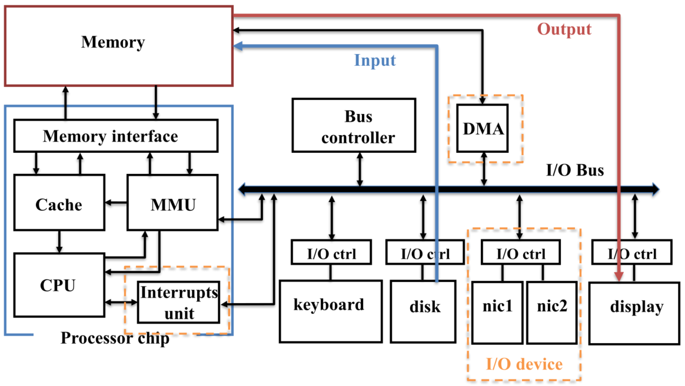
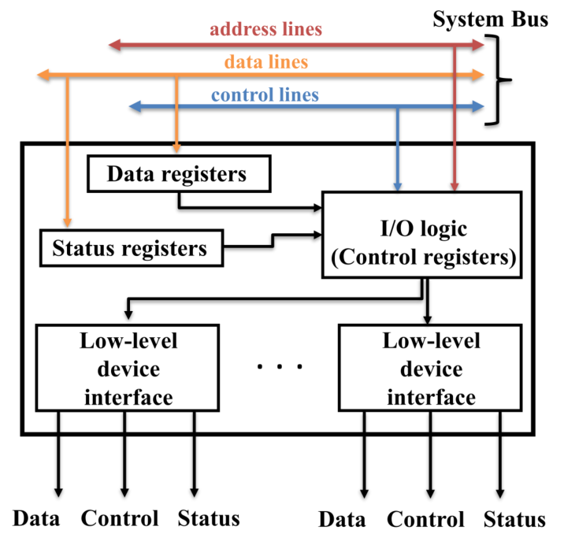
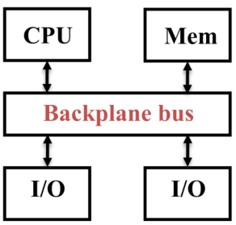
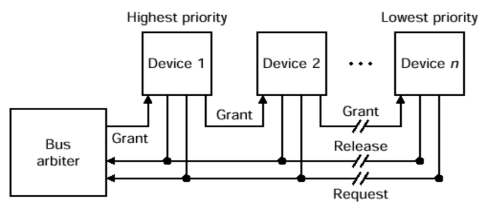
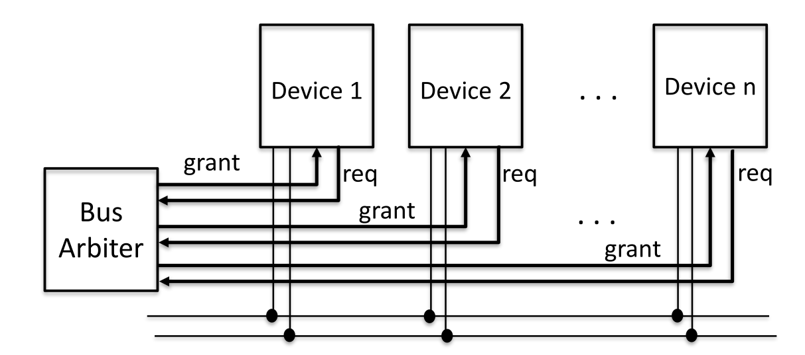

Le operazioni di **Input/Output (I/O)** hanno un impatto significativo sul tempo totale di esecuzione di un programma.

# Legge di Amdahl

La legge di Amdahl è stata proposta nel **1967** e descrive le massime potenzialità raggiungibili da un sistema quando una sua porzione viene ottimizzata.

$$
Speedup=\frac{\text{Exec.time prima dell'ottimizzazione}}{\text{Exec.time dopo l'ottimizzazione}}
$$

Nel **calcolo parallelo**, la legge di Amdahl rappresenta uno dei limiti superiori di riferimento nel processo di parallelizzazione.

Consideriamo un programma in cui solo una frazione $f$ può essere ottimizzata (ad esempio, parallelizzata con $n$ processori), mentre la frazione rimanente $(1 - f)$ rimane invariata perché intrinsecamente sequenziale.

Lo **speedup teorico** massimo ottenibile è dato da:

$$
Speedup=\frac{T(1-f)+T(f)}{T(1-f)+\frac{T(f)}{n}}=
\frac{T(1-f+f)}{T(1-f+\frac{f}{n})}=
\frac{1}{(1-f)+\frac{f}{n}}
$$

In questo esempio, il massimo speedup teorico raggiungibile è **10**. Tuttavia, questo valore è **irrealistico** nella pratica.

Il motivo è che lo speedup è **limitato dalla frazione sequenziale** $(1 - f)$, ovvero dalla parte del sistema (o programma) che non può essere migliorata o parallelizzata.

Per ottenere un **speedup significativo**, è fondamentale **minimizzare $(1 - f)$**, ovvero ridurre il più possibile la parte del programma che rimane sequenziale. Questo concetto è cruciale nell'ottimizzazione dei sistemi paralleli e multi-thread.

# Principi di I/O

Le performance sono molto importanti, ma contano anche aspetti come:

## Affidabilità

L'affidabilità di un sistema si misura attraverso metriche come:

- **MTTF (Mean Time To Failure)** $\rightarrow$ Tempo medio di vita di un componente;
- **MTBF (Mean Time Between Failure)** $\rightarrow$ Tempo medio che intercorre tra i guasti non irreparabili.
- **Fault avoidance** $\rightarrow$ Evitare i guasti per es. scegliendo componenti migliori.
- **Fault tolerance** $\rightarrow$ tolleranza ai guasti per es. introducendo livelli di ridondanza.

Un esempio comune di tolleranza ai guasti è il **RAID** (**Redundant Array of Independent Disks**), utilizzato nei sistemi di archiviazione critici per proteggere i dati da guasti hardware.

## Disponibilità

La disponibilità di un sistema è influenzata dal tempo necessario per ripararlo, misurato dal **MTTR (Mean Time To Repair)**.

L'**availability** si calcola con la formula:

$$
Availability = \frac{MTTF}{MTTF + MTTR}
$$

Un'alta disponibilità è essenziale nei sistemi critici, dove il tempo di inattività deve essere ridotto al minimo.

# Porte di I/O

I dispositivi di I/O dispongono di due porte principali.

## Controllo

Questa porta è utilizzata per **inviare comandi** e **leggere lo stato** del dispositivo.  
Permette al sistema di:

- **Specificare le operazioni** che il dispositivo deve eseguire (es. avviare la stampa di un PDF).
- **Rilevare eventuali malfunzionamenti** o conoscere le **capacità del dispositivo** (es. quantità di buffer disponibile).
- **Verificare lo stato operativo** (es. carta esaurita in una stampante).

## Dati

Questa porta è destinata al **trasferimento di grandi quantità di informazioni** tra la memoria del dispositivo e il sistema.

**Esempio:** lettura di un blocco di dati da un disco rigido.

# Dispositivo di I/O generico

Un dispositivo di **I/O** è collegato al **bus di sistema** tramite un **controller di I/O**, che gestisce la comunicazione tra il dispositivo e la CPU.

## Componenti principali

- **Linee di indirizzo (Address lines)**: utilizzate per selezionare il dispositivo specifico.
- **Controller di I/O**: gestisce il trasferimento dei dati tra il dispositivo e il sistema.
- **Linee dati (Data lines)**: utilizzate per inviare e ricevere dati.
- **Bus di sistema (System Bus)**: connette il controller di I/O alla CPU e alla memoria.
- **Linee di controllo (Control lines)**: trasportano segnali di comando e stato.

# Controller di I/O

Un **controller di I/O** è un componente che gestisce la comunicazione tra **CPU, memoria e dispositivi periferici**, garantendo un trasferimento efficiente dei dati.  
Funziona come un **intermediario** tra il bus di sistema e i dispositivi periferici.

## Elementi principali

- **Linee di indirizzo (Address lines)**: consentono di identificare il dispositivo specifico con cui comunicare.
- **Registri (Registers)**: memorizzano e gestiscono dati, comandi e informazioni di stato.
- **Interfacce a basso livello (Low-level interfaces)**: gestiscono i segnali elettrici necessari per eseguire le operazioni di I/O.

## Funzioni del controller di I/O

Il **controller di I/O** svolge un ruolo essenziale nella gestione della comunicazione tra il **processore, la memoria e i dispositivi di input/output**.

La sua funzione principale è garantire un **flusso di dati efficiente e sincronizzato**, evitando conflitti o perdite di informazioni durante il trasferimento.

### Controllo e sincronizzazione

Per assicurare il corretto funzionamento del sistema, il controller regola il flusso dei dati e dei segnali tra i diversi componenti.

Una gestione accurata della **sincronizzazione** è fondamentale per prevenire problemi di latenza o sovraccarico, specialmente quando si interfacciano dispositivi con velocità di trasferimento differenti.

### Comunicazione con il processore

Il controller interpreta e gestisce i comandi provenienti dal processore.

Inoltre, riconosce gli indirizzi delle periferiche e garantisce che i dati vengano inviati alla destinazione corretta senza interferenze.

### Comunicazione con il dispositivo

Oltre a interfacciarsi con il processore, il controller gestisce il dialogo diretto con le periferiche.

Ciò include lo **scambio di comandi, dati e informazioni di stato**, permettendo ai dispositivi di rispondere in modo adeguato alle richieste del sistema.

### Buffering dei dati

Poiché molti dispositivi di I/O operano a velocità diverse rispetto alla CPU e alla memoria, il controller utilizza tecniche di **buffering** per immagazzinare temporaneamente i dati in transito.

Questo permette di ridurre i tempi di attesa e ottimizzare il trasferimento delle informazioni, evitando rallentamenti dovuti a discrepanze di velocità.

### Rilevamento degli errori

Infine, il controller implementa meccanismi per individuare e gestire eventuali **errori di trasmissione**.

Identificare e correggere tempestivamente tali problemi è essenziale per garantire l’affidabilità e la stabilità del sistema.

# Comunicazioni tra CPU e device di I/O

Il trasferimento di dati tra un dispositivo di I/O e il processore avviene attraverso una serie di passaggi ben definiti, gestiti dal **controller di I/O**. Questa sequenza garantisce un'interazione corretta e sincronizzata tra i componenti del sistema.

1. **Verifica dello stato del dispositivo**  
   Il processore invia una richiesta al modulo di I/O per conoscere lo stato del dispositivo.

2. **Risposta del controller**  
   Il controller di I/O restituisce al processore un segnale che indica se il dispositivo è pronto per il trasferimento dei dati o se è occupato.

3. **Avvio del trasferimento**  
   Se il dispositivo è pronto, il processore invia un comando al controller per iniziare il trasferimento dei dati.

4. **Lettura dal dispositivo**  
   Il controller di I/O acquisisce i dati dalla periferica, ad esempio leggendo un blocco da un disco o ricevendo un input da una tastiera.

5. **Trasferimento al processore**  
   Una volta ottenuti i dati, il controller li invia al processore attraverso il bus di sistema.

Durante queste operazioni, è possibile che avvengano **una o più azioni di arbitraggio del bus**, necessarie per gestire l’accesso coordinato alle risorse di comunicazione e garantire il rispetto del protocollo di trasferimento.

# Bus

Un **bus** è un insieme di **linee dati** trattate come un unico segnale logico, utilizzato per connettere più dispositivi all'interno di un sistema. Le periferiche collegate a un bus condiviso vengono chiamate **taps**.

## Caratteristiche principali

Il **bus** rappresenta un mezzo di trasmissione condiviso, in cui più dispositivi possono essere connessi e scambiarsi dati.

I **taps** sono i dispositivi che possono inviare o ricevere dati attraverso il bus.

Le **prestazioni** del bus dipendono da diversi fattori, tra cui:

- **Lunghezza fisica** del bus.
- **Numero di dispositivi** collegati, poiché un numero elevato di taps può influenzare la velocità di trasmissione.

## Gestione dell'accesso al bus

Poiché il bus è una risorsa condivisa, **solo un dispositivo alla volta può trasmettere con successo**. Se più dispositivi tentano di trasmettere contemporaneamente, si possono verificare conflitti.

Per evitare questo problema, si utilizza un meccanismo di **arbitraggio del bus**, che assegna l’accesso ai dispositivi in base a criteri di priorità e correttezza, garantendo una comunicazione efficiente e priva di interferenze.

## System Bus

Collega il **processore** e la **memoria**, mentre il bus di I/O è connesso tramite adattatori.

- **Caratteristiche**:
  - **Corto**, con pochi dispositivi collegati $\rightarrow$ **veloce e ad alta larghezza di banda**.
  - **Non standard**, varia in base al sistema.
- **Esempi**: Front-Side Bus (FSB), QPI.

## I/O Bus

Collega i **dispositivi di I/O**, senza connessione diretta a processore e memoria.

- **Caratteristiche**:
  - **Più lungo**, con più dispositivi $\rightarrow$ **più lento e con minore larghezza di banda**.
  - **Standard industriale**.
- **Esempi**: PCI, PCIe, USB, SATA.

## Backplane Bus

Collega **CPU, memoria e dispositivi di I/O** in un'unica infrastruttura.

- **Caratteristiche**:
  - **Molto lungo**, con molti dispositivi collegati $\rightarrow$ **velocità media o bassa**.
  - Supporta dispositivi con **diverse larghezze di banda**.
  - **Standard industriale**.
- **Esempi**: VMEbus, Multibus.

## Progettazione del Bus

La progettazione di un bus deve bilanciare **prestazioni, standardizzazione e costi**.

I diversi tipi di bus hanno obiettivi differenti:

- Il **System Bus** privilegia le **prestazioni**;
- i **bus di I/O e Backplane** puntano sulla **standardizzazione e sulla riduzione dei costi**.

Nella progettazione di un Bus un primo aspetto da considerare è se i suoi **fili siano condivisi o separati**.

Un **bus più largo** consente una maggiore larghezza di banda, ma comporta anche **costi più elevati** e un rischio maggiore di **skew**, ossia disallineamenti nei segnali che possono compromettere il corretto funzionamento del sistema.

Un altro elemento critico riguarda la **gestione del controllo del bus**.
Esistono due principali strategie:

### Transazioni atomiche

Le **transazioni atomiche**, che completano una comunicazione alla volta.

Questa soluzione è **più semplice da implementare**, ma porta a un utilizzo **meno efficiente** del bus.

### Spit-transactions

Le **split-transactions**, che permettono di interlecciare richieste e risposte di più dispositivi.

Questo approccio migliora l’**utilizzo del bus**, ma introduce una **maggiore complessità di gestione**, richiedendo ad esempio l’uso di identificatori per distinguere le diverse richieste.

Inoltre il bus può essere **sincrono** o **asincrono**:

### Sincrono

Nel caso di un bus sincrono, tutti i dispositivi collegati condividono lo stesso segnale di clock.

Questo significa che tutte le operazioni avvengono in corrispondenza di un fronte di salita del clock, garantendo una sincronizzazione precisa tra i dispositivi.

Un possibile protocollo di comunicazione tra due unità, **A** e **B**, potrebbe funzionare nel seguente modo:

- Al ciclo di clock $X$, l'unità **A** scrive una richiesta di **LETTURA** sul bus.
- Dopo un intervallo di tempo massimo pari a $\Delta$, ovvero al ciclo $X + \Delta$, l'unità **A** legge i dati dal bus.
- Il valore di $\Delta$ rappresenta il tempo massimo richiesto dall'unità **B** per scrivere i dati sul bus.

Uno dei problemi principali che può emergere in un bus sincrono è lo **skew del clock**, ovvero un disallineamento del segnale di clock tra i vari dispositivi connessi.

Questo fenomeno può portare a errori nella comunicazione se i segnali non arrivano simultaneamente a tutti i nodi del bus.

A causa di questa limitazione, i bus sincroni sono solitamente **di lunghezza ridotta**, come nel caso dei **bus di sistema** all'interno di un computer, dove la velocità di trasferimento è prioritaria rispetto alla distanza coperta.

### Asincrono

A differenza del bus sincrono, un **bus asincrono** non utilizza un segnale di clock globale.

Ciò elimina il problema dello skew del clock, ma rende necessaria l'implementazione di un **protocollo di handshaking**, un meccanismo di sincronizzazione che permette ai dispositivi di comunicare correttamente senza una temporizzazione predefinita.

L'assenza di un clock permette al bus di coprire distanze maggiori rispetto a un bus sincrono, ma ciò si traduce generalmente in una velocità di trasferimento inferiore.

Un possibile protocollo di comunicazione asincrono, basato su **tre linee di controllo** e **una linea dati** (su cui vengono multiplexati indirizzi e dati), può funzionare nel seguente modo:

1. L'unità **UIO1** scrive una richiesta di **LETTURA (o SCRITTURA)** sulla linea di controllo (_ReadReq_ o _WriteReq_), mentre l'indirizzo della memoria o del dispositivo da cui leggere i dati viene scritto sulla linea dati.
2. L'unità **UIO2**, dopo aver ricevuto l'indirizzo, invia un segnale di **ACK** (acknowledge) sulla linea di controllo a **UIO1**, indicando di aver ricevuto correttamente la richiesta.
3. **UIO2** scrive i dati sul bus e invia il segnale **DataReady** sulla linea di controllo per notificare a **UIO1** che i dati sono disponibili.
4. L'unità **UIO1** legge i dati dalla linea dati e invia un **ACK** a **UIO2** per confermare l'avvenuta ricezione.

Questo tipo di comunicazione consente una maggiore flessibilità, ma introduce una latenza maggiore rispetto ai bus sincroni, poiché ogni operazione richiede un numero maggiore di scambi tra i dispositivi prima che la trasmissione possa considerarsi completata.

Infine, è fondamentale stabilire **chi può accedere al bus** in presenza di più dispositivi che desiderano trasmettere dati contemporaneamente:

## Arbitraggio del Bus

L'arbitraggio è un **protocollo di comunicazione** che serve a garantire un utilizzo corretto delle risorse condivise.

Quando più dispositivi cercano di accedere al bus contemporaneamente, il meccanismo di **arbitraggio** sceglie quale dispositivo può ottenere il controllo, tenendo conto di criteri di **priorità** e **equità** (evitando il problema della starvation).

L'unità che ha la capacità di iniziare una richiesta sul bus è detta **bus master**.

- La configurazione più semplice prevede un solo master.
- Alcuni bus possono supportare **più master**, consentendo a diverse unità di richiedere l'accesso al bus.

L'**arbiter** è il componente responsabile della gestione delle richieste e dell'assegnazione del bus, garantendo un equilibrio tra **priorità** ed **equità**.

L'arbitraggio può essere realizzato seguendo due approcci principali:

### Arbitraggio Centralizzato

Un dispositivo dedicato (**Arbiter**) raccoglie tutte le richieste e decide quale unità può accedere al bus.

Questo modello è semplice, ma può diventare un **collo di bottiglia**.

Ci sono due implementazioni principali per questo approccio:

- **Daisy-chain**: semplice da implementare, ma poco equo.
- **Con linee di richiesta/risposta indipendenti**: metodo ampiamente utilizzato, migliora l'equità e riduce i ritardi.

### Arbitraggio Distribuito

Ogni dispositivo è in grado di vedere le richieste contemporaneamente e partecipa al processo di selezione del master successivo.

Questo metodo è più **complesso** da realizzare e richiede un **numero elevato di linee di controllo**, ma elimina il problema del collo di bottiglia dell'approccio centralizzato.

## Daisy-Chain Arbiter

Il metodo **Daisy-Chain** è un tipo di arbitraggio centralizzato in cui i dispositivi sono connessi al bus in ordine di priorità.

- I dispositivi con **priorità più alta** sono posizionati più vicini all'**arbiter**.
- I dispositivi con **priorità più alta** possono **intercettare o negare** le richieste provenienti da dispositivi con priorità inferiore.

### Vantaggi e Svantaggi

- :white_check_mark: **Semplice da implementare**
- :x: **Lento**
- :x: **Non garantisce equità**, poiché i dispositivi con priorità inferiore possono rimanere senza accesso al bus (**starvation**).

### Funzionamento

- **Linea di richiesta (Request Line)**: è una **wired-OR line**, ovvero una linea condivisa in cui più dispositivi possono effettuare richieste.
- **Linea di concessione (Grant Line)**: il segnale di concessione viene propagato attraverso tutti i dispositivi.

Se un dispositivo ha effettuato una richiesta, prenderà il controllo del bus non appena riceve il segnale di concessione.

Una volta ottenuto il controllo, il dispositivo **disattiva la grant line**, impedendo agli altri di accedere al bus finché non termina la sua operazione.

## Centralized Arbiter

Il metodo **Centralized Arbiter** utilizza un arbitro dedicato che gestisce l'accesso al bus attraverso **canali indipendenti** di richiesta (**req**) e concessione (**grant**) per ciascun dispositivo.

### Caratteristiche

- **Controllo centralizzato**: i dispositivi comunicano direttamente con l'arbiter.
- L'arbiter assegna l'accesso al bus in base a:
  - **Priorità**: alcuni dispositivi hanno una priorità più alta (**fissa o dinamica**).
  - **Round-robin**: i dispositivi vengono serviti in ordine ciclico per garantire equità.

### Vantaggi e Svantaggi

- :white_check_mark: **Gestione efficiente delle richieste**
- :x: **Single Point of Failure (SPOF)**: se l’arbiter si guasta, l’intero sistema si blocca.

### Funzionamento

- **Linea di richiesta (Request Line)**: ogni dispositivo invia una richiesta all'arbiter tramite una linea dedicata.
- **Linea di concessione (Grant Line)**: l'arbiter concede l'accesso al bus al dispositivo selezionato attivando la relativa linea di grant.

Se più dispositivi fanno richiesta contemporaneamente, l'arbiter decide in base alla **priorità** o al **round-robin**.

Il dispositivo selezionato prende il controllo del bus ed esegue la sua operazione.

Una volta terminata, il dispositivo rilascia il bus e l'arbiter può assegnarlo a un altro richiedente.
