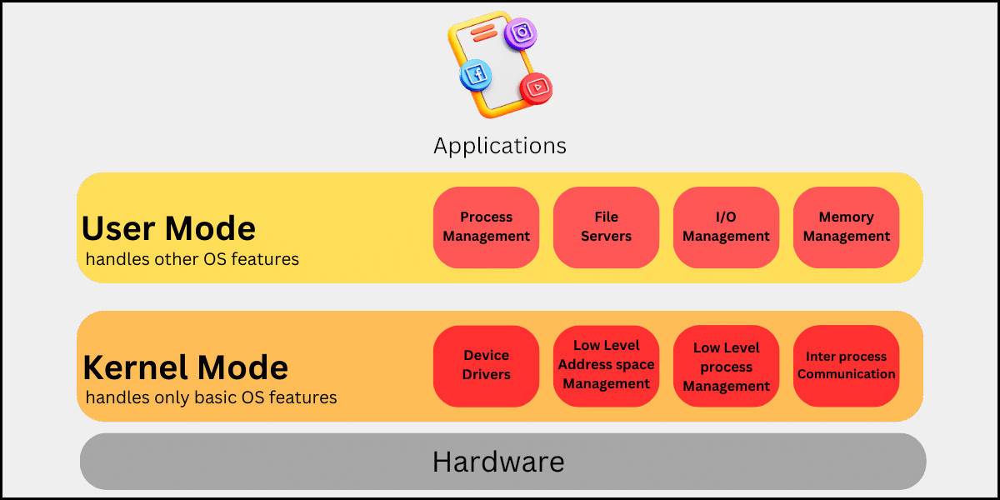

# Definizione

Il sistema operativo di un dispositivo è il componente software che si occupa di gestire le risorse hardware del
dispositivo stesso, ponendosi come intermediario tra le applicazioni utilizzate dall'utente e l'hardware.

# Condivisione delle risorse

Come mostrato nello schema soprastante, un sistema operativo deve essere in grado di gestire più applicazioni
contemporaneamente, per fare ciò i sistemi operativi devono svolgere 3 ruoli:

## Referee (Arbitro)

Il sistema operativo deve arbitrare l'uso delle risorse da parte dei programmi garantendo:

-   **Isolamento**: L'esecuzione di un'applicazione non dovrebbe influire sul resto del sistema e non dovrebbe avere
    accesso ai dati al di fuori dell'aria di memoria isolata, assegnatagli dal sistema operativo.
-   **Comunicazione**: Il rovescio della medaglia è che le applicazioni e gli utenti devono poter comunicare tra di
    loro, per questo la applicazioni possono superare i confini dettati dal sistema operativo, con un'attenta
    supervisione da parte di quest'ultimo.

## Illusionist (Illusionista)

Il sistema operativo fornisce un'astrazione dell'hardware sottostante chiamata virtualizzazione, che consente di
semplificare lo sviluppo di applicazioni. Le applicazioni hanno l'illusione di avere risorse infinite e di avere tutte
le risorse per se, sarà compito del sistema operativo modificare le risorse assegnate ad ogni applicazione in modo da
garantirne la corretta esecuzione.

Con il giusto supporto hardware e del sistema operativo la maggior parte delle risorse fisiche può essere virtualizzata.
Spingendosi ancora oltre con questo meccanismo si può virtualizzare un'intera macchina su un sistema operativo, questo
tipo di macchine sono chiamate macchine virtuali. Il vantaggio più grande delle macchine virtuali è quello di garantire
la portabilità delle applicazioni.

## Glue (Colla)

I sistemi operativi forniscono un set di servizi comuni che facilitano la condivisione di dati tra applicazioni. Alcuni
forniscono anche interfacce utenti comuni in maniera tale che le applicazioni possano avere lo stesso "aspetto e
comportamento". Inoltre, forniscono un livello di astrazione anche per i dispositivi di I/O per rendere i programmi
indipendenti dagli stessi.

# Valutazione di un sistema operativo

Un sistema operativo può essere valutato in base a:

## Affidabilità e disponibilità

Un sistema si dice affidabile se fà esattamente quello per cui è stato progettato. Un sistema operaqtivo deve essere
affidabile essendo che è il software più a contatto con l'hardware e quindi i suoi errori possono avere effetti
devastanti e nascosti.

Rendere affidabile un sistema operativo non è facile, essi operano in un ambiente ostile con virus che spesso cercano di
sfruttare le vulnerabilità del sistema stesso.

I metodi comuni per migliorare un software sono più austici da applicare ai sistemi operativi proprio perché i virus
mirano alle vulnerabilità specifiche dello stesso.

Un concetto correlato è la disponibilità, ossia la percentuale di tempo in cui un sistema è utilizzabile. Un sistema
operativo affidabile avrà un'alta disponibilità.

Essa è influenzata da 2 fattori:

-   **Tempo medio al guasto (MTTF)**;
-   **Tempo medio alla riparazione (MTTR)**.

## Sicurezza

Due concetti correleati all'affidabilità sono sicurezza e privacy. Sicurezza significa che il funzionamento della
macchina non può essere compromesso. Mentre privacy è l'inaccessibilità dei dati da parte di chiunque non sia
autorizzato.

Nessun sistema operativo è perfettamente sicuro, ma dovrebbe fare in modo di ridurre al minimo le vulnerabilità.

Il fatto che utenti e programmi debbano poter comunicare tra loro, inoltre, rende ancora più difficile garantire la
sicurezza e la privacy.

Il sistema operativo garantisce la sicurezza tramite delle politiche di sicurezza che gestiscono i permessi che ha un
utente o un'applicazione.

## Portabilità

La portabilità di un software è la sua capicità di essere eseguito al variare dell'hardware senza bisogno di modificare
il codice.

Tramite la **macchina virtuale astratta (AVM)** i sistemi operativi sono ingrado di rendere indipendente l'evoluzione
dell'hardware da quella del software.

l'AVM fornisce:

-   L'interfaccia di programmazione delle applicazioni (**API**);
-   L'elenco delle chiamate alle funzioni di sistema (le funzioni il sistema operativo fornisce alle applicazioni);
-   Il modello di accesso alla memoria;
-   Le istruzioni che possono essere eseguite legalmente.

Questi concetti sono talmente importanti da essere utilizzati all'interno dei sistemi operativi stessi tramite
un'**interfaccia** chiamata **strato di astrazione hardware (HAL)**.

## Prestazioni

Le prestazioni di un'applicazione dipendono anche dalla velocità del sistema operativo su cui vengono eseguite.

Una metrica delle prestazioni è l'**overhead**, il costo di risorse aggiuntive per implementare un'astrazione presentata
alle applicazioni. Un concetto correlato è l'**efficienza** che non è altro che la mancanza di overhead. L'overhead può
essere misurato è determinare quanto l'astrazione ostacola le prestazioni dell'applicazione.

Un problema è garantire l'equità tra utenti e applicazioni, due concetti correlati sono il **ritardo** e il
**throughput**. Il ritardo è il tempo impiegato per l'esecuzione di un singolo **task**, il **throughput** è la velocità
con cui il sistema completà un gruppo di attività.

Una considerazione correlata è la prevedibilità delle prestazioni, ossia se il tempo di risposta è coerente nel tempo.

## Adozione

Il successo di un sistema operativo dipende anche dal supporto che riceve da hardware e software. Gli utenti tendono a
scegliere una piattaforma in base alla convenienza dell'hardware e alla disponibilità del software, mentre i progettisti
si concentrano sulle piattaforme con la base installata più ampia. Questo crea un circolo virtuoso: più utenti
significano maggiore supporto.

Quindi nel progettare un sistema operativo bisogna tener conto di facilitare l'implementazione di nuovo hardware e
software (per esempio adottando standard per le API).

# Passato, presente e futuro

Nonostante l'aumento esponenziale della potenza di calcolo, come descritto dalla legge di **Moore**, i sistemi operativi
continuano ad affrontare le stesse sfide concettuali e con ogni probabilità le affronteranno anche in futuro.

## I primi sistemi operativi

Nonostante la bassa complessità dei primi sistemi informatici, era necessario un sistema operativo per ridurre gli
errori dei programmatori, poiché questi comportavano costi elevati. Di conseguenza, i primi sistemi operativi erano
concepiti come un insieme standard di servizi comuni.

## Sistemi operativi multiutente

Il passo successivo fu l'introduzione della condivisione per evitare lo spreco di tempo e risorse.

Un **sistema operativo batch** esegue un insieme di task seguendo un semplice ciclo: caricare, eseguire e scaricare ogni
task. In ogni fase può essere elaborato un task diverso grazie a un processo chiamato **accesso diretto alla memoria
(DMA)**.

Con questo sistema, il dispositivo di I/O trasferisce i dati direttamente in memoria; una volta completato il
trasferimento, l'hardware genera un **interrupt**, trasferendo il controllo al gestore degli interrupt del sistema
operativo.

Quest'ultimo avvia il successivo DMA e riprende l'esecuzione, mentre il processo non si accorge di nulla se non per un
breve ritardo.

Il passo successivo fu l'introduzione del **multitasking**, ovvero l'esecuzione di più applicazioni in contemporanea.
Questo ha reso necessaria l'isolazione dei programmi, ottenuta mediante la protezione della memoria a livello hardware.

Una delle sfide del batch computing è il debugging del sistema operativo stesso. In questo contesto, le macchine
virtuali si rivelano particolarmente utili.

## time-sharing

I **sistemi operativi time-sharing** sono
