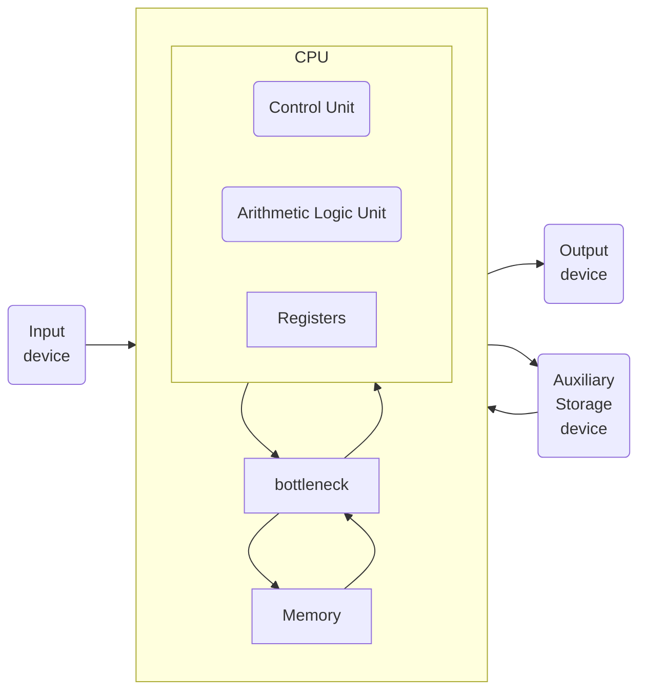
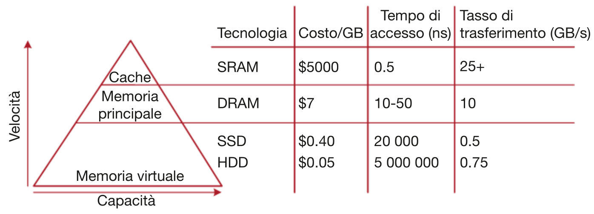

- [Gerarchie di memoria](#gerarchie-di-memoria)
  - [Gerarchia di memoria](#gerarchia-di-memoria)
  - [Terminologia e analisi delle prestazioni](#terminologia-e-analisi-delle-prestazioni)
    - [Hit e Miss](#hit-e-miss)
    - [Hit rate e Miss rate](#hit-rate-e-miss-rate)
    - [Miss penalty](#miss-penalty)
    - [Miss time](#miss-time)
    - [Il tempo medio di accesso a memoria](#il-tempo-medio-di-accesso-a-memoria)
  - [Legge di Amdahl](#legge-di-amdahl)
  - [cache](#cache)
  - [cache performance](#cache-performance)

---

# Gerarchie di memoria

L'**architettura di von Neumann** separa CPU e memoria, che comunicano tramite in'interfaccia di memoria.

Il processore invia un indirizzo al sistema di memoria tramite il **bus indirizzi**.

In caso di lettura, il segnale **MemWrite** vale **0** e la memoria restituisce il dato sul **bus di lettura dati**.

In caso di scrittura, il segnale **MemWrite** vale **1** e il processore invia il dato alla memoria sul **bus di scrittura dati**.

Mentre un tempo calcolo e accesso alla memoria erano bilanciati, oggi la CPU è molto più veloce della memoria, creando un divario di prestazioni significativo.

Questo effetto viene chiamato **von Neumann bottleneck**.

## Gerarchia di memoria

Il sistema di memoria ideale dovrebbe essere **veloce, grande ed economico**, ma in pratica ogni tipo di memoria soddisfa solo due di questi requisiti.

Per avvicinarsi a questo ideale, si combina:

- una memoria **veloce, piccola ed economica**
- con una memoria **lenta, grande ed economica**

La **memoria veloce** conserva i dati più usati, migliorando le prestazioni, mentre la **memoria grande** assicura un'elevata capacità complessiva.

Questo approccio è detto **gerarchia di memoria** ed è **più economico** rispetto a una memoria unica che sia contemporaneamente grande e veloce.

La **memoria** dei calcolatori è generalmente costituita da chip **DRAM** che rappresentano la memoria **grande ma lenta**.

Le **CPU** hanno al loro interno uno o più livelli di memoria **cache**, la memoria **veloce ma piccola**, che memorizza istruzioni e dati usati più di frequente.

Le **cache** sono costituite generalmente da **SRAM**, che sono intrinsecamente più veloci delle **DRAM**. Inoltre, la posizione a bordo del processore elimina i ritardi dovuti alla propagazione dei segnali elettrici tra chip diversi.

Inoltre esiste un livello più basso che è costituito dalla **memoria virtuale**, costituita dal **disco rigido**.

La **memoria principale**, detta anche **memoria fisica**, contiene un sottoinsieme della **memoria virtuale**.

Il processore per prima cosa cerca il dato in una memoria piccola ma veloce generalmente presente a bordo del suo stesso chip. Se non trova il dato, il processore guarda nella memoria principale. Se non lo trova neanche lì, lo preleva dalla memoria virtuale sul disco rigido, capiente ma lento.

## Terminologia e analisi delle prestazioni

### Hit e Miss

Se il processore trova il dato nel livello di memoria attuale abbiamo un **Hit**, altrimenti si dice **Miss**.

### Hit rate e Miss rate

Il tasso di hit/miss è la probabilità di ottenere un hit/miss.

$$
MR = \frac{\text{Numero Miss}}{\text{Numero totale di accessi a memoria}}=1-HR
$$

$$
HR = \frac{\text{Numero Hit}}{\text{Numero totale di accessi a memoria}}=1-MR
$$

### Miss penalty

La miss penalty è il tempo necessario per sostituire un blocco al livello n con il corrispondente blocco dal livello n-1.

### Miss time

Il Miss time è il tempo richiesto per recuperare un elemento in caso di un miss.

$$\text{miss time}=\text{miss penalty}+\text{hit time}$$

### Il tempo medio di accesso a memoria

Il tempo medio di accesso a memoria (AMAT, Average Memory Access Time) è il tempo medio di attesa da parte del processore per completare un’istruzione di lettura da o scrittura in memoria.

Il processore guarda prima nella cache.

Se si verifica un miss, guarda nella memoria principale.

Se si verifica un secondo miss, il processore accede alla memoria virtuale su disco rigido.

- $t_{x}$ = tempo di accesso al livello x.
- $TM_{x}$ = Miss rate del livello x.

$$AMAT=\text{hit-time}+\text{miss-rate}*\text{miss-penalty}$$

$$AMAT=t_{1}+MR_{1}(t_{2}+MR_{2}(t_{3}+...))$$

## Legge di Amdahl

Lo sforzo per migliorare le prestazioni di un sottosistema è utile solo se tale sottosistema influisce su una larga percentuale delle prestazioni globali.

## cache

## cache performance
