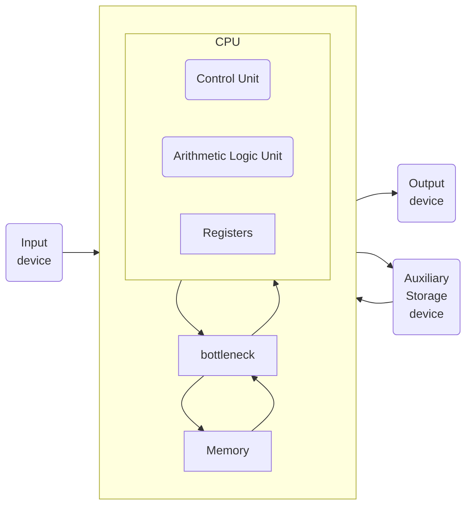
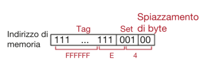
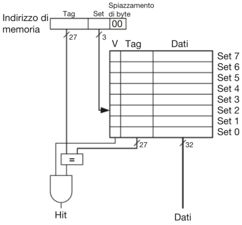
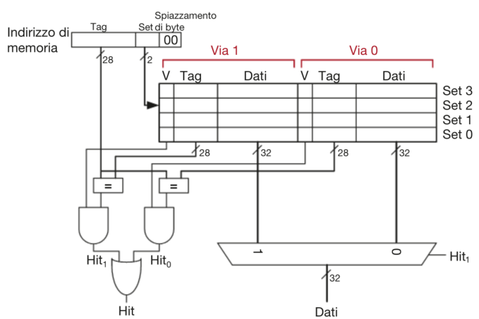
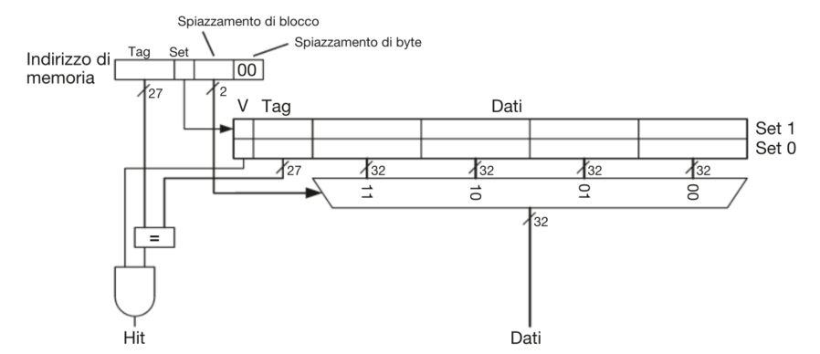

- [Gerarchie di memoria](#gerarchie-di-memoria)
  - [Gerarchia di memoria](#gerarchia-di-memoria)
  - [Terminologia e analisi delle prestazioni](#terminologia-e-analisi-delle-prestazioni)
    - [Hit e Miss](#hit-e-miss)
    - [Hit rate e Miss rate](#hit-rate-e-miss-rate)
    - [Miss penalty](#miss-penalty)
    - [Miss time](#miss-time)
    - [Il tempo medio di accesso a memoria](#il-tempo-medio-di-accesso-a-memoria)
  - [Legge di Amdahl](#legge-di-amdahl)
  - [cache](#cache)
    - [Località spaziale](#località-spaziale)
    - [Località temporale](#località-temporale)
    - [Cache a mappatura diretta](#cache-a-mappatura-diretta)
      - [Struttura dell’Indirizzo](#struttura-dellindirizzo)
    - [Cache parzialmente associativa](#cache-parzialmente-associativa)
      - [Vantaggi e Svantaggi](#vantaggi-e-svantaggi)
    - [Cache completamente associativa](#cache-completamente-associativa)
      - [Vantaggi e Svantaggi](#vantaggi-e-svantaggi-1)
    - [Tabella riassuntiva](#tabella-riassuntiva)
    - [Politiche di Sostituzione: LRU e Pseudo-LRU](#politiche-di-sostituzione-lru-e-pseudo-lru)
      - [LRU nelle Cache Parzialmente Associative](#lru-nelle-cache-parzialmente-associative)
      - [Pseudo-LRU](#pseudo-lru)
    - [Cache multi-livello](#cache-multi-livello)
  - [cache performance](#cache-performance)

---

# Gerarchie di memoria

L'**architettura di von Neumann** separa CPU e memoria, che comunicano tramite in'interfaccia di memoria.

Il processore invia un indirizzo al sistema di memoria tramite il **bus indirizzi**.

In caso di lettura, il segnale **MemWrite** vale **0** e la memoria restituisce il dato sul **bus di lettura dati**.

In caso di scrittura, il segnale **MemWrite** vale **1** e il processore invia il dato alla memoria sul **bus di scrittura dati**.

Mentre un tempo, calcolo e accesso alla memoria erano bilanciati, oggi la CPU è molto più veloce della memoria, creando un divario di prestazioni significativo.

Questo effetto viene chiamato **von Neumann bottleneck**.

## Gerarchia di memoria

Il sistema di memoria ideale dovrebbe essere **veloce, grande ed economico**, ma in pratica ogni tipo di memoria soddisfa solo due di questi requisiti.

Per avvicinarsi a questo ideale, si combina:

- una memoria **veloce, piccola ed economica**
- con una memoria **lenta, grande ed economica**

La **memoria veloce** conserva i dati più usati, migliorando le prestazioni, mentre la **memoria grande** assicura un'elevata capacità complessiva.

Questo approccio è detto **gerarchia di memoria** ed è **più economico** rispetto a una memoria unica che sia contemporaneamente grande e veloce.

La **memoria** dei calcolatori è generalmente costituita da chip **DRAM** che rappresentano la memoria **grande ma lenta**.

Le **CPU** hanno al loro interno uno o più livelli di memoria **cache**, la memoria **veloce ma piccola**, che memorizza istruzioni e dati usati più di frequente.

Le **cache** sono costituite generalmente da **SRAM**, che sono intrinsecamente più veloci delle **DRAM**. Inoltre, la posizione a bordo del processore elimina i ritardi dovuti alla propagazione dei segnali elettrici tra chip diversi.

Esiste anche un livello più basso che è costituito dalla **memoria virtuale**, costituita dal **disco rigido**.

La **memoria principale**, detta anche **memoria fisica**, contiene un sottoinsieme della **memoria virtuale**.

Il processore per prima cosa cerca il dato in una memoria piccola ma veloce generalmente presente a bordo del suo stesso chip. Se non trova il dato, il processore guarda nella memoria principale. Se non lo trova neanche lì, lo preleva dalla memoria virtuale sul disco rigido, capiente ma lento.

## Terminologia e analisi delle prestazioni

### Hit e Miss

Se il processore trova il dato nel livello di memoria attuale abbiamo un **Hit**, altrimenti si dice **Miss**.

### Hit rate e Miss rate

Il tasso di hit/miss è la probabilità di ottenere un hit/miss.

$$
MR = \frac{\text{Numero Miss}}{\text{Numero totale di accessi a memoria}}=1-HR
$$

$$
HR = \frac{\text{Numero Hit}}{\text{Numero totale di accessi a memoria}}=1-MR
$$

### Miss penalty

La miss penalty è il tempo necessario per sostituire un blocco al livello n con il corrispondente blocco dal livello n-1.

### Miss time

Il Miss time è il tempo richiesto per recuperare un elemento in caso di un miss.

$$\text{miss time}=\text{miss penalty}+\text{hit time}$$

### Il tempo medio di accesso a memoria

Il tempo medio di accesso a memoria (AMAT, Average Memory Access Time) è il tempo medio di attesa da parte del processore per completare un’istruzione di lettura da o scrittura in memoria.

Il processore guarda prima nella cache.

Se si verifica un miss, guarda nella memoria principale.

Se si verifica un secondo miss, il processore accede alla memoria virtuale su disco rigido.

- $t_{x}$ = tempo di accesso al livello x.
- $TM_{x}$ = Miss rate del livello x.

$$AMAT=\text{hit-time}+\text{miss-rate}*\text{miss-penalty}$$

$$AMAT=t_{1}+MR_{1}(t_{2}+MR_{2}(t_{3}+...))$$

## Legge di Amdahl

Lo sforzo per migliorare le prestazioni di un sottosistema è utile solo se tale sottosistema influisce su una larga percentuale delle prestazioni globali.

## cache

La memoria **cache** conserva i dati usati più frequentemente. Il numero di parole che può contenere è la sua **capacità C**.

Poiché **C è molto inferiore alla memoria principale**, è necessario selezionare quali dati mantenere in cache.

Quando il processore accede a un dato:

- Se è in cache (**hit**), è **immediatamente disponibile**.
- Se non è in cache (**miss**), viene **prelevato dalla memoria principale** e **salvato in cache** per utilizzi futuri, sostituendo un dato meno recente.

Una **cache ideale** avrebbe **zero miss**, ma poiché ciò è impossibile, la cache predice i dati necessari basandosi sugli accessi passati. In particolare, sfrutta la **località spaziale** e **temporale** per ridurre i miss.

### Località spaziale

È probabile che, dopo aver letto un dato, si accederà anche ai dati vicini (es. array).

### Località temporale

Se un dato è stato utilizzato, è probabile che venga riutilizzato a breve (es. cicli).

Per sfruttare la località spaziale, la cache non preleva solo un dato alla volta, ma un **blocco di cache** contenente più parole. Il numero **b** di parole per blocco è la **dimensione del blocco**.

Una cache con capacità **C** ha quindi **B = C / b** blocchi, organizzati in **S set**.

La relazione tra un indirizzo di memoria e la sua posizione in cache è definita **mappatura** (mapping). Alcuni bit dell’indirizzo determinano in quale set si trova il dato.

Se un set contiene più blocchi, il dato può essere memorizzato in uno qualsiasi di essi. Le cache sono classificate in base al numero di blocchi per set.

### Cache a mappatura diretta

Una **cache a mappatura diretta** suddivide la memoria in blocchi di **b parole**, organizzati in **S = B set** nella cache.

- Ogni blocco di memoria è assegnato a un set specifico della cache.
- La mappatura è **circolare**: quando si superano i set disponibili, i blocchi successivi sovrascrivono i precedenti nel medesimo set.

Poiché più indirizzi possono essere mappati nello stesso set, la cache deve memorizzare l’indirizzo esatto del dato presente in ogni set.

- I **bit meno significativi** dell’indirizzo identificano il **set** in cui il dato è memorizzato.
- I **bit più significativi**, chiamati **tag**, indicano quale indirizzo specifico è effettivamente presente nel set.

#### Struttura dell’Indirizzo

- **Spiazzamento**: ci sono $log_2l$ bit di spiazzamento(offset) dove $l =$ lunghezza di parola.
- **Bit di set**: i successivi $log_2S$ bit indicano il set in cui il dato è mappato.
- **Tag**: i restanti bit identificano l’indirizzo effettivo del dato nel set.

Esempio con lunghezza di parola di 8 bit e S=8

Occasionalmente, i set della cache non contengono dati, perciò la cache usa un **bit di validità** per ogni set che indica se il set contiene dati significativi.

Quando due indirizzi recenti si mappano nello stesso blocco di cache, si verifica un **conflitto**: il dato più recente sostituisce il precedente.

Nelle **cache a mappatura diretta**, ogni set contiene un solo blocco, quindi due indirizzi che si mappano nello stesso set causano sempre un conflitto.

### Cache parzialmente associativa

Una **cache parzialmente associativa a N vie** riduce i conflitti poichè ha **N blocchi per set**.

- Ogni indirizzo di memoria viene mappato in un **set specifico**, ma può essere memorizzato in **uno qualsiasi degli N blocchi** del set.
- Una **cache a mappatura diretta** è un caso particolare di cache parzialmente associativa con **N = 1**.
- **N** è chiamato **grado di associatività** della cache.

Struttura circuitale di una cache parzialmente associativa a $N = 2$ vie di capacità $C = 8$ parole.

Ogni **set** contiene **N vie** (gradi di associatività), dove:

- Ogni **via** è composta da un **blocco di dati**, un **tag** e un **bit di validità**.
- La cache legge i blocchi di tutte le vie nel set e confronta i **tag** e i **bit di validità**.
- Se si verifica un **hit**, un **multiplexer** seleziona il dato dalla via corrispondente.

#### Vantaggi e Svantaggi

:white_check_mark: **Meno conflitti** e **tassi di miss inferiori** rispetto alla mappatura diretta.

:x: **Più lenta e costosa** a causa del multiplexer di uscita e dei comparatori aggiuntivi.

### Cache completamente associativa

Una **cache completamente associativa** ha un **unico set** con **B vie**, dove **B è il numero totale di blocchi**.

- Un indirizzo di memoria può essere memorizzato in **qualsiasi blocco** della cache.
- È un caso particolare di **cache parzialmente associativa** con **grado di associatività B**.

- Ogni **set** contiene **un solo blocco**.
- Con **2 set**, sono necessari **log₂2 = 1 bit** per selezionare il set.
- Un **multiplexer** sceglie la parola all’interno del blocco.
- Serve **un solo tag** per l’intero blocco, poiché le parole hanno **indirizzi consecutivi**.

#### Vantaggi e Svantaggi

:white_check_mark: **Meno conflitti** rispetto ad altre configurazioni.

:x: **Richiede più hardware** per il confronto dei tag.

:x: **Adatta solo per cache piccole** a causa dell’elevato numero di comparatori.

### Tabella riassuntiva

| Organizzazione            | Numero di vie (M) | Numero di set in cache (S) |
| ------------------------- | ----------------- | -------------------------- |
| A mappatura diretta       | 1                 | B                          |
| Parzialmente associativa  | 1 < N < B         | B/N                        |
| Completamente associativa | B                 | 1                          |

### Politiche di Sostituzione: LRU e Pseudo-LRU

Il **principio di località temporale** suggerisce di **sostituire il blocco meno utilizzato di recente** (Least Recently Used, **LRU**) poiché ha **minor probabilità di essere riutilizzato a breve**.

#### LRU nelle Cache Parzialmente Associative

- **Cache a 2 vie**: un **bit di utilizzo (U)** indica quale via è stata usata meno di recente.
  - Ogni accesso aggiorna **U** per indicare l’altra via.
- **Cache con più di 2 vie**: gestire LRU diventa complesso.

#### Pseudo-LRU

- Le vie vengono divise in **due gruppi**.
- **U indica il gruppo meno utilizzato** di recente.
- Alla sostituzione, si rimpiazza **un blocco a caso** all’interno del gruppo.
- È una **soluzione semplificata** ma efficace in pratica.

### Cache multi-livello

I moderni calcolatori adottano spesso almeno due livelli di cache per cercare di ridurre i tempi di ridurre l'[AMAT](#il-tempo-medio-di-accesso-a-memoria)

## cache performance
