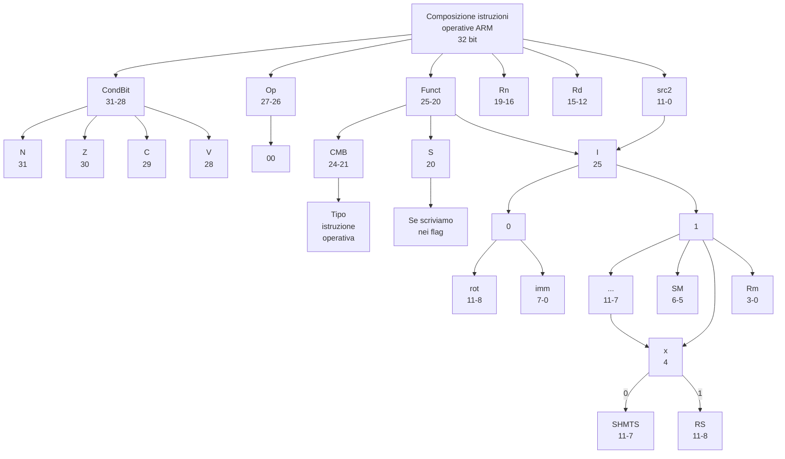
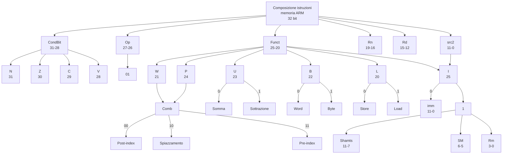
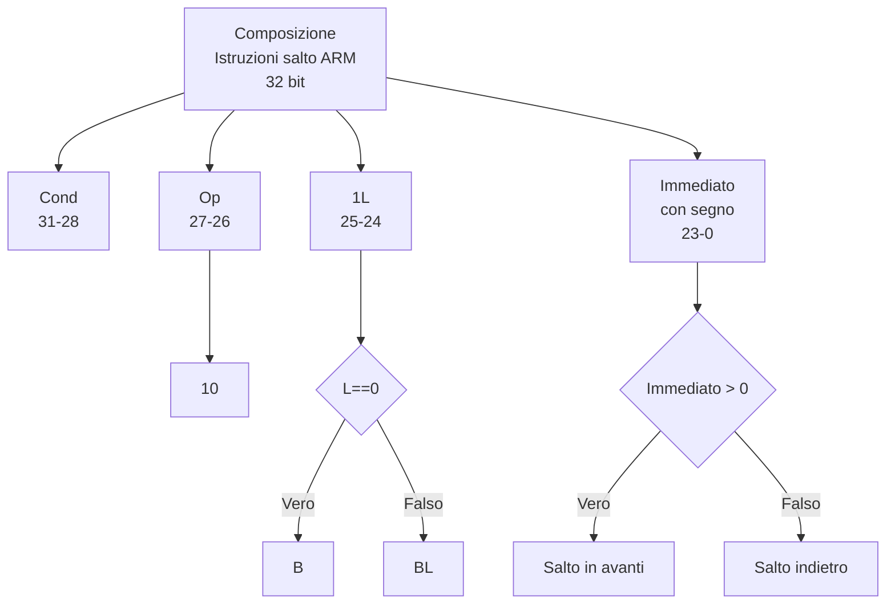

- [Assembler](#assembler)
  - [Costanti](#costanti)
  - [Registri](#registri)
  - [Memoria](#memoria)
  - [Istruzioni](#istruzioni)
    - [Shift](#shift)
  - [Flag](#flag)
    - [Mnemonici di condizione](#mnemonici-di-condizione)
    - [Mnemonici più utili per CMP](#mnemonici-più-utili-per-cmp)
  - [Salti](#salti)
  - [Costrutti](#costrutti)
    - [cicli](#cicli)
    - [Memoria](#memoria-1)
- [Istruzioni macchina](#istruzioni-macchina)

---

# Assembler

I calcolatori comprendono istruzioni in codice binario (chiamato codice macchina) che sono tradotte 1:1 con il codice assembly.

Il codice macchina non dipende dalla [Microarchitettura](#astrazione-disciplina-e-le-tre-y).

I quattro principi definiti da **David Patterson** e **John Hennessy**:

- **Regolarità**: favorisce la semplicità;
- Rendere veloci le cose frequenti;
- Più piccolo è più veloce;
- Un buon progetto richiede buoni compromessi.

ARM è un calcolatore con architettura **RISC** (Reduced Instruction Set Computer).
Il set di istruzioni di ARM rende veloci le cose frequenti inserendo solo istruzioni semplici usate spesso.

## Costanti

Sono semplici **numeri** ed in **Assembly** si indicano mettendo il **'#'** seguito dal **numero** desiderato.

## Registri

Visto che l'accesso alla memoria è un'operazione lenta le **CPU** hanno dei loro registri.
L’architettura **ARM** usa **16 registri**, globalmente indicati come **register file**.
Meno sono i registri, più rapidamente sono accessibili.
Il **register file** è generalmente costituito da un piccolo **array** (vettore) di memoria **SRAM**.

In **Assembly** i nomi dei **registri** sono composti dalla lettera **R** seguita da un **numero** e i registri hanno degli utilizzi specifici indicati nella seguente tabella:

| Registri | Utilizzi                                            |
| -------- | --------------------------------------------------- |
| R0       | Parametro/valore da restituire/variabile temporanea |
| R1-R3    | Parametri/variabili temporanee                      |
| R4-R11   | Variabili salvate                                   |
| R12      | Variabile temporanea                                |
| R13 (SP) | Stack Pointer                                       |
| R14 (LR) | Link Register                                       |
| R15 (PC) | Program Counter                                     |

Per quanto riguarda le variabili temporanee, possiamo utilizzarle senza preoccuparci dei dati che c'erano prima.
Mentre, se utilizzialo le variabili salvate dobbiamo rimettere al loro interno i dati che c'erano prima dell'esecuzione del nostro programma prima di terminarlo.

(Si può fare facilmente salvandole nello stack per poi riprenderle prima della fine del programma.)

## Memoria

Ma i dati possono anche essere memorizzati nella **RAM**.
In **ARM** le **istruzioni** operano **solo sui registri**, quindi i dati presenti in memoria devono essere copiati nei registri prima di essere elaborati.

L’architettura **ARM** usa **32 bit** per gli **indirizzi** di memoria e 32 bit per le **parole** di dato e fa uso di memoria indirizzabile a byte (**byte addressable**), cioè ogni **byte** di memoria ha un **indirizzo univoco**.

Una **parola** di **32 bit** (**word**) è costituita da quattro byte da 8 bit ciascuno, quindi **ogni indirizzo di parola è un multiplo di 4**.

L’istruzione **LDR** specifica l’indirizzo di memoria usando un **registro base** e un **offset**.

L’indirizzo di memoria viene formato **sommando** il contenuto del **registro base** e l'**offset**.

ARM usa l’istruzione **STR** (**STore Register**) per scrivere una parola di dato da un **registro** in **memoria**.

Le memorie indirizzabili a byte sono organizzate in modalità **big-endian** oppure **little-endian**.
Nel primo si iniziano a salvare i dati in memoria dal bit **più significativo**, mentre nel secondo dal **meno significativo**.
**ARM** è **little-endian**.

## Istruzioni

Il formato di una tipica istruzione è:

```armasm
CMD Rd, Rn, Rm/Imm
@ exemple
SUM R0, R1, #5
```

| Codice assembly ARM | Significato           |
| ------------------- | --------------------- |
| MOV                 | Move                  |
| MVN                 | Move and not          |
| ADD                 | Sum                   |
| SUB                 | Subtraction           |
| MUL                 | Moltiply              |
| UMUL                | Unsigned MUL (64 bit) |
| SMUL                | Signed MUL (64 bit)   |
| MLA                 | MUL Accumulate        |
| UMLAL               | UMUL Accumulate       |
| SMLAL               | SMUL Accumulate       |
| AND                 | And                   |
| ORR                 | Or                    |
| EOR                 | Xor                   |
| BIC                 | Byte clear (And not)  |

### Shift

| Codice assembly ARM | Significato            |
| ------------------- | ---------------------- |
| LSL                 | Logical shift left     |
| LSR                 | Logical shift right    |
| ASR                 | Arithmetic shift right |
| ROR                 | Rotate right           |

## Flag

Alcune operazioni possono impostare dei flag (bit a 0 o 1) che possiamo utilizzare per eseguire delle operazioni solo se il flag in questione è a 1 scrivendo il flag attaccato all'operazione da eseguire come fosse un unico comando. L'operazione più comune per impostare i flag è la compare (CMP),che confronta due valori e aggiorna i flag di conseguenza.

Di seguito sono riportati tutti i flag:

| Flag |   Nome : |
| ---- | -------: |
| N    | Negative |
| Z    |     Zero |
| C    |    Carry |
| V    | Overflow |

### Mnemonici di condizione

| **Cond** | **Mnemonico** | **Nome**                                                                           | **CondEse**                   |
| -------- | ------------- | ---------------------------------------------------------------------------------- | ----------------------------- |
| 0000     | EQ            | Uguale (_Equal_)                                                                   | Z                             |
| 0001     | NE            | Diverso (_Not Equal_)                                                              | $\overline{Z}$                |
| 0010     | CS/HS         | Attiva riporto/maggiore o uguale senza segno (_Carry Set/unsigned Higher or Same_) | C                             |
| 0011     | CC/LO         | Disattiva riporto/minore senza segno (_Carry Clear/unsigned Lower_)                | $\overline{C}$                |
| 0100     | MI            | Meno/negativo (_Minus/negative_)                                                   | N                             |
| 0101     | PL            | Più/positivo o nullo (_Plus/positive or zero_)                                     | $\overline{N}$                |
| 0110     | VS            | Traboccamento/attiva traboccamento (_overflow/overflow Set_)                       | V                             |
| 0111     | VC            | No traboccamento/disattiva traboccamento (_overflow/overflow Clear_)               | $\overline{V}$                |
| 1000     | HI            | Maggiore senza segno (_unsigned Higher_)                                           | $Z \overline{C}$              |
| 1001     | LS            | Minore o uguale senza segno (_unsigned Lower or Same_)                             | $Z \ OR \ \overline{C}$       |
| 1010     | GE            | Maggiore o uguale con segno (_signed Greater than or Equal_)                       | $\overline{N} \oplus V$       |
| 1011     | LT            | Minore con segno (_signed Less Than_)                                              | $N \oplus V$                  |
| 1100     | GT            | Maggiore con segno (_signed Greater Than_)                                         | $\overline{Z} \ (N \oplus V)$ |
| 1101     | LE            | Minore o uguale con segno (_signed Less than or Equal_)                            | $Z \ OR \ (N \oplus V)$       |
| 1110     | AL (o niente) | Sempre/incondizionato (_ALways/unconditional_)                                     | Ignorato                      |

### Mnemonici più utili per CMP

| **Mnemonico** | **Nome**      |
| ------------- | ------------- |
| EQ            | Equal         |
| NE            | Not Equal     |
| GT            | Greater Than  |
| LT            | Lower Than    |
| GE            | Greater Equal |
| LE            | Lower Equal   |

## Salti

B (Branch) si usa per saltare ad una determinata etichetta del codice, mentre BL (Branch and link) si usa per chiamare funzioni esterne o per chiamate ricorsive.

## Costrutti

### cicli

```armasm
func:
  mov r0, #0
loop:
  cmp r0, r1
  beq end
  @ code
  add r0, r0, #1
  b loop
end:
  mov pc, lr
```

### Memoria

```armasm
LDR R3, [R0, R1, LSL #2]
@ Salva in R3 il contenuto del registro (r0 + (r1*4))
LDR R0, [R1, R2]!
@ Il ! serve ad indicare che r1 viene modificato
LDR R0, [R1], R2
@ Uguale alla forma di sopra solo che l'incremento viene eseguito dopo
LDRB @Carica un byte (si usa uguale alla LDR)
LDRSB @ Signed byte
STR R9, [R0, #8]
@ salva R9 nell' indirizzo di memoria contenuto in r0
PUSH {...} @ carica nello stack LIFO
POP {...} @ scarica dallo stack
```

# Istruzioni macchina



---



---


