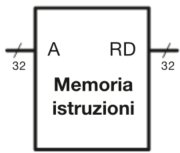
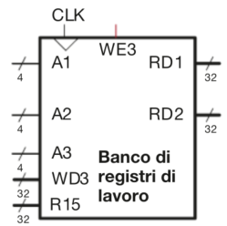
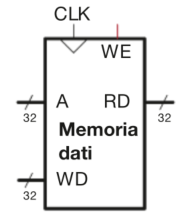
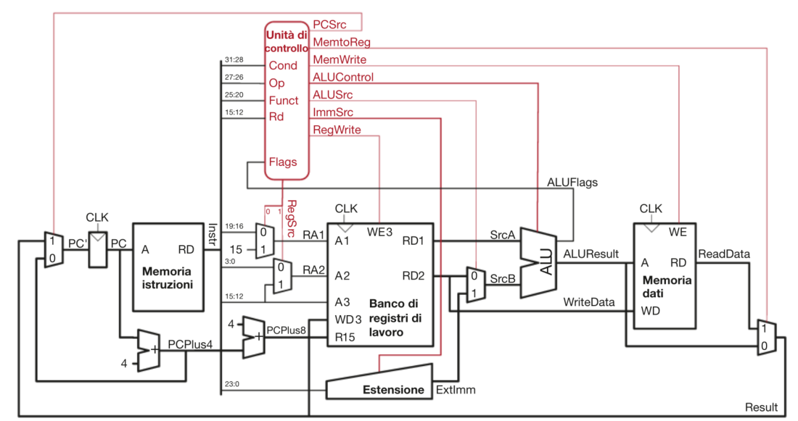
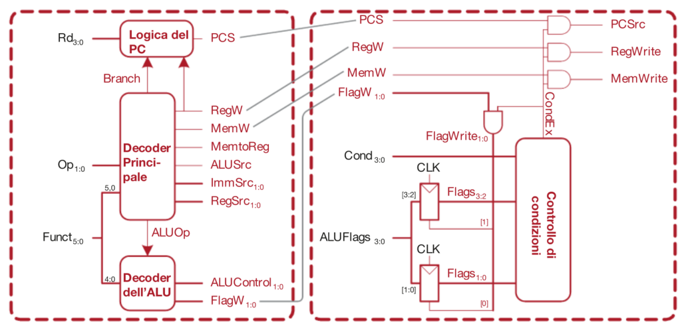
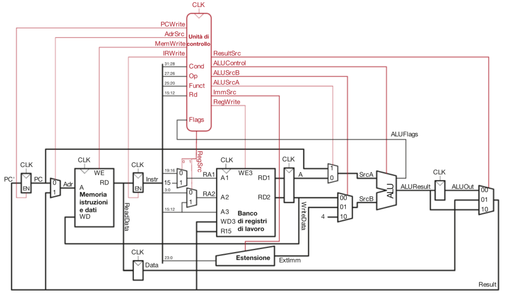
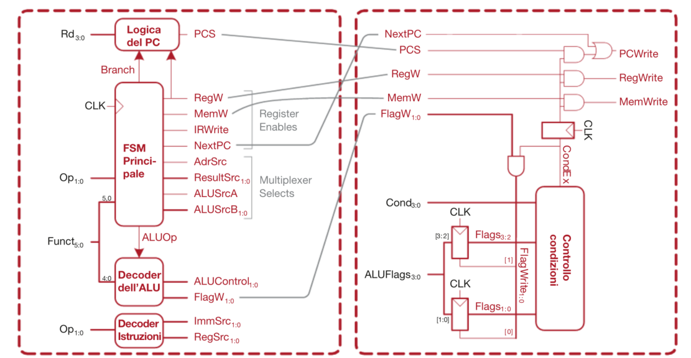
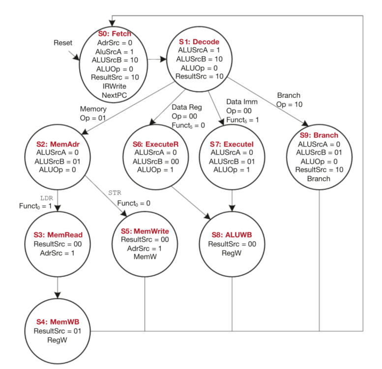
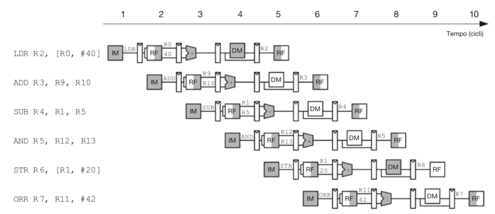
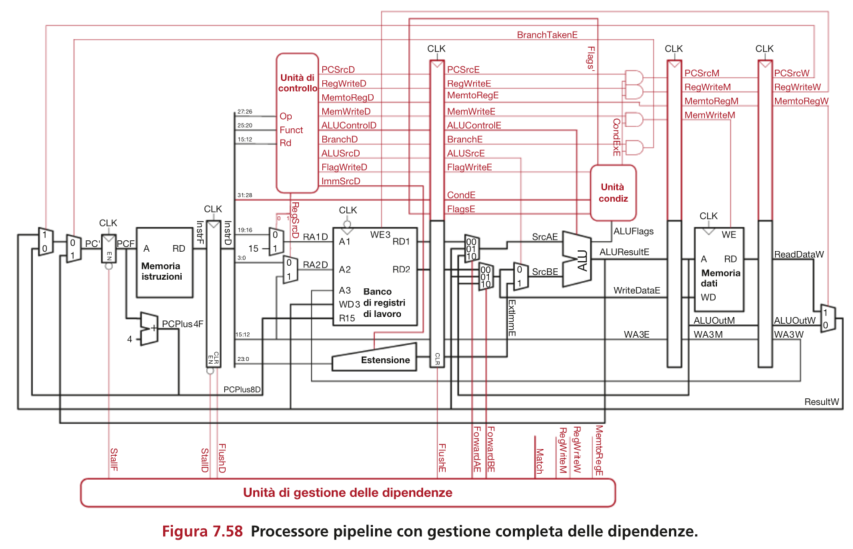

- [Microarchitettura](#microarchitettura)
  - [Istruzioni macchina](#istruzioni-macchina)
  - [Stato architetturale](#stato-architetturale)
  - [Datapath](#datapath)
    - [Program counter](#program-counter)
    - [Memoria istruzioni](#memoria-istruzioni)
    - [Banco dei registri di lavoro](#banco-dei-registri-di-lavoro)
    - [Memoria dati](#memoria-dati)
  - [Single-cycle](#single-cycle)
    - [Control unit](#control-unit)
    - [Analisi prestazionale](#analisi-prestazionale)
  - [Multi-cycle](#multi-cycle)
    - [Control unit](#control-unit-1)
    - [Stati](#stati)
    - [Analisi prestazionale](#analisi-prestazionale-1)
  - [Pipeline](#pipeline)
    - [Datapath](#datapath-1)
    - [Control unit](#control-unit-2)
    - [Dipendenze](#dipendenze)
  - [Microarchitetture avanzate](#microarchitetture-avanzate)
    - [Previsione dei salti](#previsione-dei-salti)
    - [Processori super-scalari](#processori-super-scalari)
    - [Processore out-of-order](#processore-out-of-order)
    - [Multithreading](#multithreading)
    - [Multiprocessori](#multiprocessori)

---

# Microarchitettura

L'architettura del calcolatore è definita da un set di istruzioni e da uno stato architetturale.

## Istruzioni macchina

```mermaid
graph TD
  Title[Composizione istruzioni<br>operative ARM<br>32 bit]
  Title --> Cond[CondBit<br>31-28]
  Cond --> N[N<br>31]
  Cond --> Z[Z<br>30]
  Cond --> C[C<br>29]
  Cond --> V[V<br>28]
  Title --> Op[Op<br>27-26] --> 00
  Title --> Funct[Funct<br>25-20]
  Funct --> CMD[CMB<br>24-21] --> CMDdes[Tipo<br>istruzione<br>operativa]
  Funct --> S[S<br>20] --> Sdes[Se scriviamo<br>nei flag]
  Title --> Rn[Rn<br>19-16]
  Title --> Rd[Rd<br>15-12]
  Title --> src[src2<br>11-0]
  src --> I -->I0[0]
  Funct --> I[I<br>25]
  I0 --> rot[rot<br>11-8]
  I0 --> imm[imm<br>7-0]
  I --> I1[1]
  I1 --> bt[...<br>11-7] --> x[x<br>4]
  I1 --> SM[SM<br>6-5]
  I1 --> x --> |0|SHMTS[SHMTS<br>11-7]
  x --> |1|RS[RS<br>11-8]
  I1 --> Rm[Rm<br>3-0]
```

---

```mermaid
graph TD
  Title[Composizione istruzioni<br>memoria ARM<br>32 bit]
  Title --> Cond[CondBit<br>31-28]
  Cond --> N[N<br>31]
  Cond --> Z[Z<br>30]
  Cond --> C[C<br>29]
  Cond --> V[V<br>28]
  Title --> Op[Op<br>27-26] --> 01
  Title --> Funct[Funct<br>25-20]
  Funct --> P[P<br>24] --> Comb
  Funct --> U[U<br>23] -->|0|Somma
  U -->|1|Sottrazione
  Funct --> B[B<br>22] -->|0|Word
  B -->|1|Byte
  Funct --> W[W<br>21] --> Comb
  Funct --> L[L<br>20] -->|0|Store
  L -->|1|Load
  Comb -->|00|Post-index
  Comb -->|10|Spiazzamento
  Comb -->|11|Pre-index
  Title --> Rn[Rn<br>19-16]
  Title --> Rd[Rd<br>15-12]
  Title --> src[src2<br>11-0]
  src --> I -->|0|imm[imm<br>11-0]
  Funct --> I[I<br>25]
  I --> I1[1]
  I1 --> Shamts[Shamts<br>11-7]
  I1 --> SM[SM<br>6-5]
  I1 --> Rm[Rm<br>3-0]
```

---

```mermaid
graph TD
  Title[Composizione<br>Istruzioni salto ARM<br>32 bit]
  Title --> Cond[Cond<br>31-28]
  Title --> Op[Op<br>27-26] --> 10
  Title --> 1L[1L<br>25-24] --> L0{L==0} -->|Vero| B
  L0 -->|Falso| BL
  Title --> Immediate[Immediato<br>con segno<br>23-0] --> Imm0{Immediato > 0}
  Imm0-->|Vero| SA[Salto in avanti]
  Imm0-->|Falso| SI[Salto indietro]
```

## Stato architetturale

Lo stato architetturale del processore ARM è definito dal contenuto di 16 registri a 32 bit e di un registro di stato.

A partire dallo stato architetturale corrente, il processore esegue una particolare istruzione su un particolare insieme di dati per produrre un nuovo stato architetturale.

Consideriamo un sottoinsieme del set di istruzioni di ARM:

- le istruzioni di elaborazione dati **ADD**, **SUB**, **AND** e **ORR**;
- le istruzioni di accesso alla memoria **LDR** e **STR**;
- l’istruzione di salto **B**.

È opportuno dividere le microarchitetture in due parti tra loro interagenti:
Il **datapath**, che si occupa dell'esecuzione vera e propria, e la **control unit**, che si occupa di impostare le componenti del datapath per eseguire una determinata istruzione.

## Datapath

Le parti fondamentali del datapath sono:

### Program counter

Esso viene realizzarlo come registro autonomo a 32 bit.

Ingressi:

- PC' = indirizzo prossima istruzione da eseguire.

Uscite:

- PC = indirizzo istruzione corrente.

### Memoria istruzioni

Ingressi:

- A = Indirizzo istruzione (Uscita PC).

Uscite:

- RD = Istruzione da eseguire.

### Banco dei registri di lavoro

Il banco di registri di 15 elementi da 32 bit contiene i registri R0-R14, ed ha un ingresso aggiuntivo per ricevere R15 dal PC.

Ingressi:

- A1 = A2 = Porte indirizzi lettura;
- A3 = Porta indirizzo scrittura;
- WD3 = Porta dati scrittura;
- WE3 = Segnale abilitazione scrittura;
- R15 = Contenuto PC.

Uscite:

- RD1 = Uscita dei dati letti da A1;
- RD2 = Uscita dei dati letti da A2.

### Memoria dati

Ingressi:

- A = Porta indirizzo lettura/scrittura;
- WD = Porta dati scrittura;
- WE = Segnale stato scrittura/lettura;

Uscite:

- RD = (WE = 0) $\Rightarrow$ Uscita A

La memoria istruzioni, il banco di registri e la memoria dati sono tutti letti in modo combinatorio, mentre, le scritture avvengono solo in corrispondenza dei fronti di salita del clock.

Quindi il microprocessore è un circuito sequenziale sincrono.

Unendo questi componenti in maniera differente è possibile ottenere microarchitetture diverse.

Le seguenti microarchitetture differiscono per il modo in cui i vari elementi di stato sono connessi tra loro e per la quantità di stato non architetturale inserito.

## Single-cycle

Si parte con il progetto di una microarchitettura che esegue le istruzioni in un singolo ciclo.

### Control unit

### Analisi prestazionale

In questa architettura il clock è dato dalla somma dei tempi dell'operazione critica su LDR.

Visto che ALU, memoria e registri sono più lente rispetto alle altre componenti otteniamo la formula semplificata:

$$T_{c1}=t_{pcq\_PC}+2t_{mem}+t_{dec}+t_{RFread}+t_{ALU}+2t_{mux}+t_{RFsetup}$$

## Multi-cycle

Il processore a ciclo singolo ha due elementi di debolezza:

- Duplicazione di circuiti (memorie e sommatori);
- Ciclo di clock lungo;

Il processore multi ciclo si propone di eliminare queste tre debolezze dividendo l’istruzione in una sequenza di passi più brevi tramite l'ausilio di elementi di stato non architetturali:
in ciascun passo, il processore legge o scrive in memoria o nel banco di registri, oppure usa l’ALU.

### Control unit

### Stati

### Analisi prestazionale

Il tempo di esecuzione di un’istruzione dipende dal tempo di ciclo e dal numero di cicli necessari all’istruzione stessa.

Il processore multi ciclo usa numeri variabili di cicli per le diverse istruzioni, però questo processore svolge meno attività in ogni ciclo, quindi ha senz’altro un tempo di ciclo inferiore.

| Istruzioni           | Cicli |
| -------------------- | :---: |
| Salto                |   1   |
| elaborazione dati    |   4   |
| scrittura in memoria |   4   |
| lettura da memoria   |   5   |

Il CPI dipende quindi dalla probabilità relativa di utilizzo di ciascuna tipologia di istruzioni nel programma.

## Pipeline

Un processore pipeline si ottiene suddividendo il processore a ciclo singolo in cinque stadi di pipeline.

In questo modo, cinque istruzioni alla volta possono essere in esecuzione, una per ogni stadio.

Dal momento che ogni stadio ha circa un quinto della logica totale, la frequenza di clock dovrebbe risultare circa cinque
volte superiore.

Quindi la latenza di ogni istruzione rimane quasi inalterata, ma la capacità di lavoro (throughput) svolto dal processore è idealmente cinque volte superiore.

Letture e scritture in memoria e nel banco di registri sono le attività che introducono i maggiori ritardi nel processore.

Si è deciso qui di adottare una pipeline a cinque stadi proprio perché in questo modo ogni stadio coinvolge una sola di queste attività lente.

| Stadi      | Parte principale coinvolta |
| ---------- | -------------------------- |
| Fetch      | Instruction Memory (IM)    |
| Decode     | Register file (RF)         |
| Execute    | ALU                        |
| Memory     | Data Memory (DM)           |
| Write back | Register file (RF)         |

### Datapath

Il percorso dati del processore pipeline è ottenuto dividendo il percorso dati del processore a ciclo singolo in cinque stadi, separati da registri di pipeline.

### Control unit

Il processore pipeline usa gli stessi segnali di controllo del processore a ciclo singolo.

Tali segnali devono essere propagati nella pipeline insieme ai dati per rimanere sincronizzati con l'istruzione cui si riferiscono.

### Dipendenze

In una struttura pipeline, più istruzioni sono eseguite in modo concorrente.

Si verifica dipendenza (hazard) quando un'istruzione dipende dai risultati di un'istruzione che la precede e che non è ancora conclusa.

Una soluzione è quella di inserire istruzioni non dipendenti tra le due dipendenti per dare il tempo alla prima di completarsi.

Se non ci sono istruzioni non dipendenti, si può inserire uno stadio di **nop** (no operation) per dare il tempo alla prima di completarsi.

Ma ciò degrada le prestazioni ed è a cura del programmatore o del compilatore e si vuoole evitare di dipendere da essi.

Le dipendenze sono classificate in:

- **Dipendenze di dati**: un'istruzione dipende dai risultati di un'istruzione precedente.
- **Dipendenze di controllo**: il PC dipende da un'istruzione precedente.

Alcune dipendenze di dato possono essere risolte mediante forwarding, cioè inviando i dati direttamente dagli stadi di memory e write back a quello di execute.

Questo richiede l’aggiunta di multiplexer davanti all’ALU per selezionare l’operando dal banco di registri oppure dagli stadi Memory o Writeback.

L'istruzione LDR tuttavia non può essere risolta con il forwarding, poiché il dato non è disponibile fino allo stadio di memory.

In questo caso si inserisce uno stallo nella pipeline. Questo stadio è chiamato bolla (bubble) e si comporta come un'istruzione nop.

lo stallo di uno stadio viene effettuato disabilitando i registri di pipeline in modo che lo stato corrente non sia modificato.

Quando uno stadio viene portato in stallo, devono subire la stessa sorte anche tutti gli stadi precedenti, in modo che nessuna istruzione venga persa.

Il registro di pipeline subito dopo lo stato portato in stallo deve essere svuotato per evitare che informazioni fasulle si propaghino nella pipeline.

L’istruzione B presenta una dipendenza di controllo, per risolverla si può usare il branch prediction.

Esso consiste nel prevedere se l’istruzione sarà eseguita o meno e caricare in anticipo le istruzioni corrispondenti. Se la previsione è sbagliata, si deve svuotare la pipeline.

Per fare tutto ciò si usa un'unità di gestione delle dipendenze.

## Microarchitetture avanzate

### Previsione dei salti

La maggior parte dei processori pipeline adotta un predittore di salto per cercare di prevedere se il salto andrà eseguito o meno.

I cicli sono di solito eseguiti molte volte, quindi i salti all’indietro molto spesso sono da fare.
Una forma molto semplice di previsione dei salti è quindi quella che verifica la direzione del salto e assume che i salti all’indietro debbano essere fatti.
Viene chiamata previsione statica dei salti.

I salti in avanti sono più difficili da prevedere senza conoscere meglio la struttura del programma in esecuzione,
quindi molti processori usano una previsione dinamica dei salti che si basa sulla storia del programma per cercare di indovinare se il salto vada o meno eseguito.

I predittori dinamici memorizzano una tabella che contiene le ultime centinaia (se non migliaia) di istruzioni di salto eseguite dal processore.
La tabella,
denominata buffer delle destinazioni di salto (branch target buffer),
include la destinazione di ciascun salto e la storia del salto,
ovvero se sia stato o meno eseguito in passato.

### Processori super-scalari

Un processore super-scalare è un processore che può eseguire più di un’istruzione per ciclo.

### Processore out-of-order

Un processore out-of-order è un processore che può eseguire le istruzioni in un ordine diverso da quello in cui sono state scritte nel programma.

Ciò permette di evitare gli stalli dovuti alle dipendenze di dati.

### Multithreading

Un programma in esecuzione su un calcolatore è denominato processo. I calcolatori possono eseguire molti processi in parallelo ed ogni processo può avere uno o più thread, che possono essere eseguiti in parallelo.

In un processore convenzionale, c'è solo l'illusione che le istruzioni vengano eseguite in parallelo, in realtà vengono eseguite sequenzialmente. Se ne occupa il sistema operativo, mettendo in pausa un thread salvandone lo stato architetturale e riprendendolo in un secondo momento. Questa procedura è chiamata context switching.

Un processore multithread contiene più di una copia del proprio stato architetturale, in modo che più di un thread possa essere attivo in ogni istante.

### Multiprocessori

Intorno al 2005, gli architetti di calcolatori hanno introdotto un importante cambiamento di strategia inserendo più copie del processore nello stesso chip: ciascuna di queste copie prende il nome di core.

Un sistema multiprocessore consiste dunque di più processori e di una struttura di comunicazione tra i processori stessi.
Le tre tipologie più comuni di multiprocessori sono i multiprocessori simmetrici (detti anche omogenei), i multiprocessori eterogenei e i cluster.

I multiprocessori simmetrici sono costituiti da più core identici, che condividono la stessa memoria principale. Essi possono essere usati per eseguire un singolo processo in parallelo su più core, oppure per eseguire più processi in parallelo su più core.

I multiprocessori eterogenei sono costituiti da core diversi. Essi hanno dei vantaggi in termini di efficienza energetica, in quanto i core più piccoli consumano meno energia. Essi però aggiungono complessità al sistema, in quanto è necessario gestire la distribuzione dei processi sui core.

I cluster sono costituiti da più core, ciascuno con la propria memoria. Un esempio di cluster è rappresentato dai data center, in cui i core sono distribuiti su più server.
